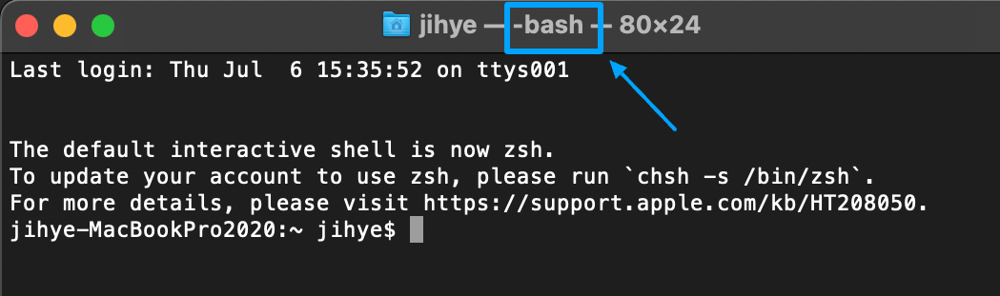

<div className="lead">

</div>

---
## 준비물

* 🍏 **맥OS**: 맥OS가 설치된 개발 환경이 필요해요. 이 글은 운영체제에 따라 매우 달라지는 내용을 다루며, 맥OS 기준으로만 설명해요.

---
## 기본 개념
셸, 셸 프롬프트, 터미널 등 용어는 명확히 구분되지 않고 사용되기 때문에 헷갈릴 수 있어요. 아래 3가지 개념만 이해하세요.

* **명령행(Command Line)**: 명령어를 입력하여 프로그램을 실행하는 텍스트 구문.
* **명령행 인터페이스(CLI, Command Line Interface)**: 명령행 방식을 통해 기능을 제공하는 인터페이스. 명령 프롬프트, 터미널, 셸, 콘솔이라고도 해요.
* **명령행 프로그램**: 명령행 인터페이스를 제공하는 프로그램. 셸, 셸 프로그램이라고도 해요.

명령행 프로그램을 실행하면 터미털 창이 나타나요. **셸 프롬프트**에 명령행을 입력하여 특정 프로그램을 실행할 수 있어요.

명령행 프로그램은 본 셸 <SideBySide>Bourne Shell, sh</SideBySide>, 본 어게인 셸 <SideBySide>Bourne-Again Shell, bash</SideBySide>, 지셸 <SideBySide>Z Shell, zsh</SideBySide>, 명령 프롬프트 <SideBySide>Command Prompt</SideBySide> 등 다양한 셸 프로그램이 있으며 운영체제마다 기본 프로그램이 달라요.

---
## 맥OS에서 사용하는 기본 명령행 프로그램 종류

* **배시(Bash, Bourne-Again Shell)**: 카탈리나 이전 버전 맥OS에는 기본적으로 배시를 사용해요.
    셸 프로그램은 `/bin/bash`에 있어요.
* **지셸(Zsh, Z Shell)**: 카탈리나 버전부터 맥OS에는 기본적으로 지셸을 사용해요.
    셸 프로그램은 `/bin/zch`에 있어요.



터미널 앱을 실행하면 기본 명령행 프로그램이 실행돼요. 창 제목에서 종류를 알 수 있어요.
`echo $SHELL` 명령행으로도 현재 사용 중인 셸 종류를 알 수 있고요.
카탈리나 이전 버전을 사용하다가 카탈리나 이후 버전으로 업데이트해도 기본 프로그렘이 지셸로 자동 변경되지 않아요.
지셸을 기본 명령행 프로그램으로 사용하고 싶다면 터미널 창에 안내에 따라 `chsh -s /bin/zsh` 명령행을 실행하세요.

참고: [Mac에서 zsh를 기본 셸로 사용하기](https://support.apple.com/kb/HT208050)

---
## 셸 프롬프트와 명령행의 구조

터미널 앱을 열면 명령어를 입력할 수 있는 셸 프롬프트에 커서가 있을 거에요.
명령행 구조를 알아보기 전에 **셸 프롬프트의 구조**에 대해 알아볼게요.
* **컴퓨터 이름**: `시스템 설정>일반>정보>이름` 에서 설정한 컴퓨터 이름이 표시돼요. 뒤에 콜론(:)이 붙어요.
* **현재 작업 디렉터리**: 홈 폴더를 의미하는 물결(~) 기호가 표시돼요. 다른 디렉터리로 이동하면 해당 디렉터리 이름이 표시돼요.
* **사용자명**: 현재 로그인한 사용자명이 표시돼요. 뒤에 달러 기호($)가 붙어요.

<p className="code-label">셸 프롬프트 예시</p>

```shell{numberLines: false}
jihye-MacBookPro2020:~ jihye$
```

셸 프롬프트에 명령어를 입력해요. **명령행은 아래 3가지 요소로 구성**돼요.

* **명령어**: 실행할 프로그램 이름과 절대경로. 프로그램이 위치한 경로를 매번 입력하지 않으려면 PATH 환경변수를 설정하면 돼요. 자세한 내용은 [PATH 환경변수를 설정](#path-환경변수-설정) 섹션을 참고하세요.
* **인수**: 프로그램에 전달할 옵션이나 값으로 공백으로 구분하여 여러 개를 전달 할 수 있어요. 인수값에 공백이 있다면 큰 따옴표(")로 묶어서 써야 제대로 전달돼요.
* **옵션**: 대시(-) 또는 이중 대시(--)로 시작하는 인수로 플래그라고도 해요.

<p className="code-label">명령행 예시</p>

```shell{numberLines: false}
cd ~
open .bashrc
python3.11
python3 -c "print('Hello World')"
npm list --depth=1
pip install requests
```

---
## 명령어로 실행 프로그램을 지정하는 3가지 방법

1. **절대경로 + 프로그램 파일명**: 셸이 실행되는 작업경로에 구애받지 않고 절대경로를 포함해서 쓸 수 있어요.

    <p className="code-label">절대경로를 포함한 명령어 예시</p>

    ```shell{numberLines: false}
    /Library/Frameworks/Python.framework/Versions/3.11/bin/python3 --version
    ```

2. **PATH 환경변수 설정 + 프로그램 파일명**: PATH 환경변수에 프로그램 파일이 위치한 경로를 등록하면 프로그램 이름만 입력해서 사용할 수 있어요.

    <p className="code-label">PATH 환경변수 설정 및 명령어 예시</p>

    ```shell{numberLines: false}
    export PATH="/Library/Frameworks/Python.framework/Versions/3.11/bin:$PATH"
    python3 --version
    ```

3. **경로 이동 + 프로그램 파일명**: 프로그램 파일이 위치한 경로로 이동 후 프로그램 이름만 입력해서 사용할 수 있어요.

    <p className="code-label">경로 이동 및 명령어 예시</p>

    ```shell{numberLines: false}
    cd /Library/Frameworks/Python.framework/Versions/3.11/bin
    python3 --version
    ```

---
## PATH 환경변수 설정

명령어를 입력하기 위해 긴 절대경로를 포함하거나 매번 경로 이동하는 번거러움을 줄이기 위해 PATH 환경변수를 사용해요.

터미널에서 `echo $PATH` 명령행을 실행하면 등록된 디렉터리를 확인 할 수 있어요. 콜론 기호(:)로 구분된 여러 디렉터리가 문자열로 등록되어 있을 거에요.
셸 프로그램은 이 값에서 **앞에 위치한 디렉터리부터 확인**하며 명령어에 맞는 프로그램이 있는지 검색해요.

<p className="code-label">PATH 환경변수 값 얻기 예시</p>

```shell{numberLines: false}
jihye-MacBookPro2020:personal-website jihye$ echo $PATH
/Library/Frameworks/Python.framework/Versions/3.8/bin:/Users/jihye/.local/bin:/opt/homebrew/bin:/opt/homebrew/sbin:/Users/jihye/.gem/ruby/2.7.0/bin:/usr/local/opt/ruby/bin:/usr/local/bin:/System/Cryptexes/App/usr/bin:/usr/bin:/bin:/usr/sbin:/sbin:/Library/Apple/usr/bin:/Applications/Postgres.app/Contents/Versions/latest/bin:/var/run/com.apple.security.cryptexd/codex.system/bootstrap/usr/local/bin:/var/run/com.apple.security.cryptexd/codex.system/bootstrap/usr/bin:/var/run/com.apple.security.cryptexd/codex.system/bootstrap/usr/appleinternal/bin:/Users/jihye/WebstormProjects/personal-website/node_modules/.bin:/usr/local/mongodb/bin
```

**임시로 PATH 값에 경로를 추가**하려면 아래와 같이 할 수 있어요.
이 방식은 현재 프로세스에서만 유효하기 때문에 터미널 창을 닫고 다시 열면 효능이 사라져요.

<p className="code-label">현재 프로세스에만 PATH 환경변수 설정하기 예시</p>

```shell{numberLines: false}
export PATH="/Library/Frameworks/Python.framework/Versions/3.11/bin:$PATH"
```

자주 사용하는 명령어는 **셸 프로그램 실행시 PATH 값으로 등록**되어 있으면 좋겠죠.
배시를 사용한다면 `~/.bashrc` 파일이나 `~/.bash_profile` 파일에, 지셸을 사용한다면 `~/.zshrc` 파일에 설정값을 추가하면 돼요.
`open ~/.bashrc` 명령행을 입력해 파일을 열고 직접 내용을 추가하거나 터미널에서 아래 명령어를 입력해요.

<p className="code-label">셸 설정 파일에 PATH 환경변수 설정하기 예시</p>

```shell{numberLines: false}
echo "export PATH=/Library/Frameworks/Python.framework/Versions/3.11/bin:$PATH" >> ~/.bashrc
```

환경변수 설정 후에 터미널을 재시작해요. `which` 명령어로 어떤 프로그램을 사용하는지 전체 경로와 파일명을 알 수 있어요.

<p className="code-label">which 사용 예시</p>

```shell{numberLines: false}
jihye-MacBookPro2020:personal-website jihye$ which python3.11
/Library/Frameworks/Python.framework/Versions/3.11/bin/python3.11
```

---
## 필수로 알아야 할 명령어

* `env`: 셸의 환경변수 확인
* `echo`: 셸의 특정 환경변수값 확인
* `which`: 명령어가 가리키는 프로그램 파일 위치
* `open`: 파일/폴더 열기
* `cd`: 디렉터리 변경
* `ls`: 현재 디렉터리에 있는 폴더와 파일 표시
* `cp`: 파일/폴더 복사
* `mv`: 파일/폴더 이동 또는 이름 변경
* `rm`: 파일/폴더 삭제
* `mkdir`: 폴더 생성
* `clear`: 터미널 내용 삭제


---
## 참고 자료

이 글을 쓰기 위해 참고한 자료는 아래와 같아요. 📚🤓🕯️

* 책 '클린 코드 이제는 파이썬이다' 알 스웨이가트 지음, 책만, 2022년.
