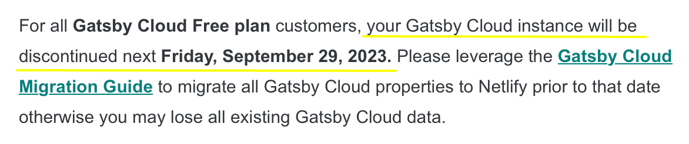
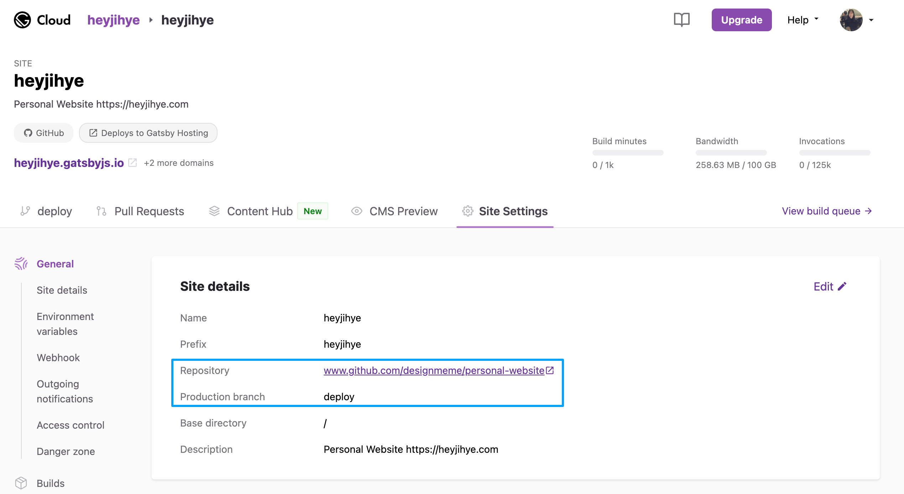
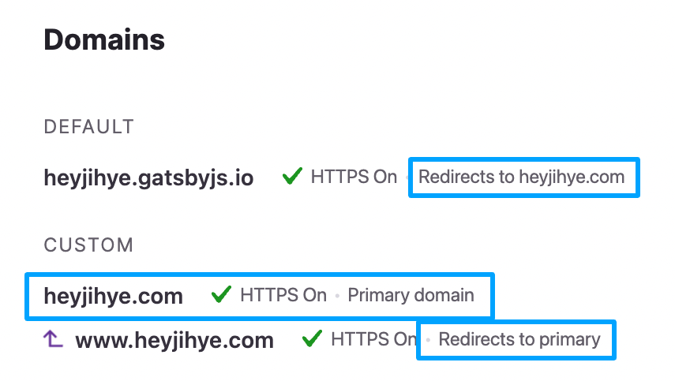
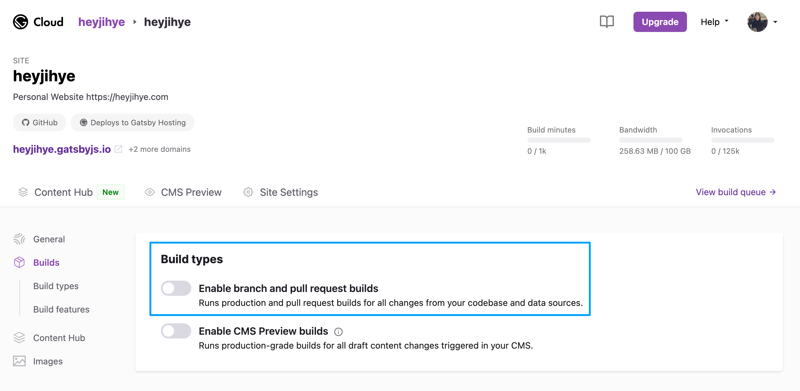
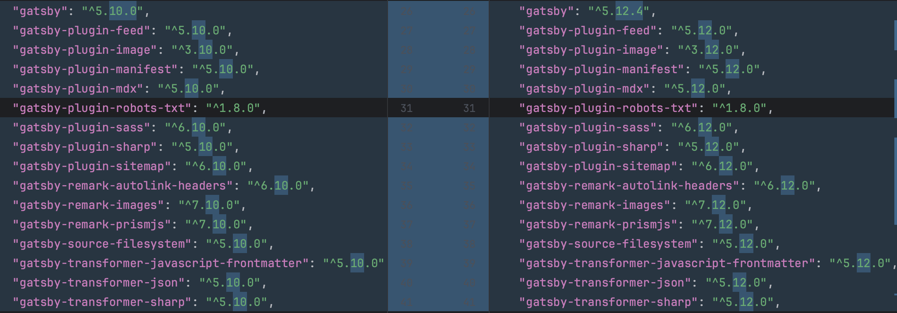
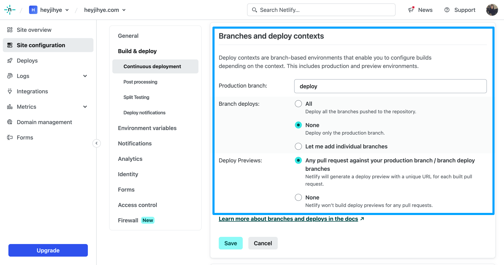
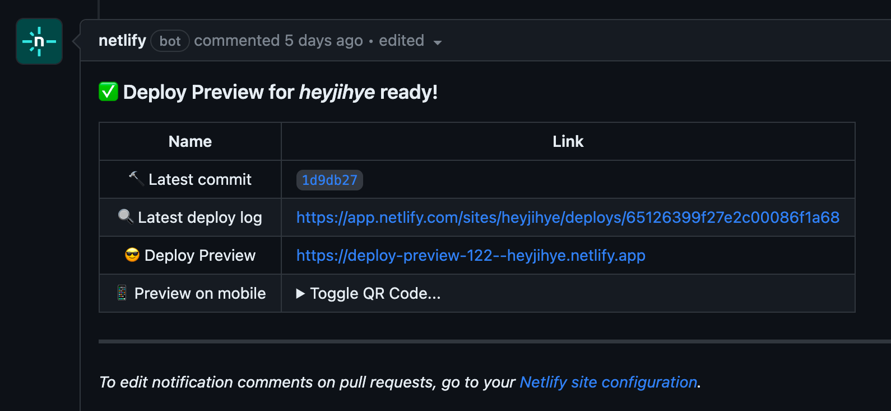
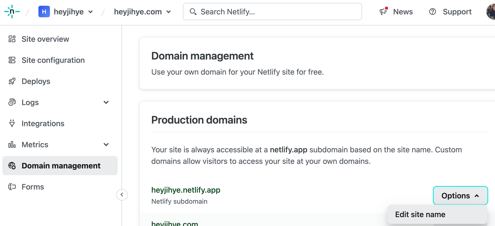
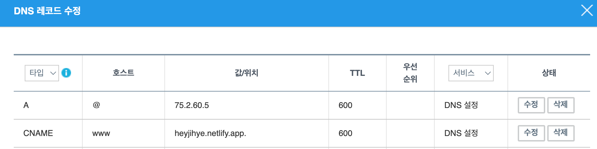
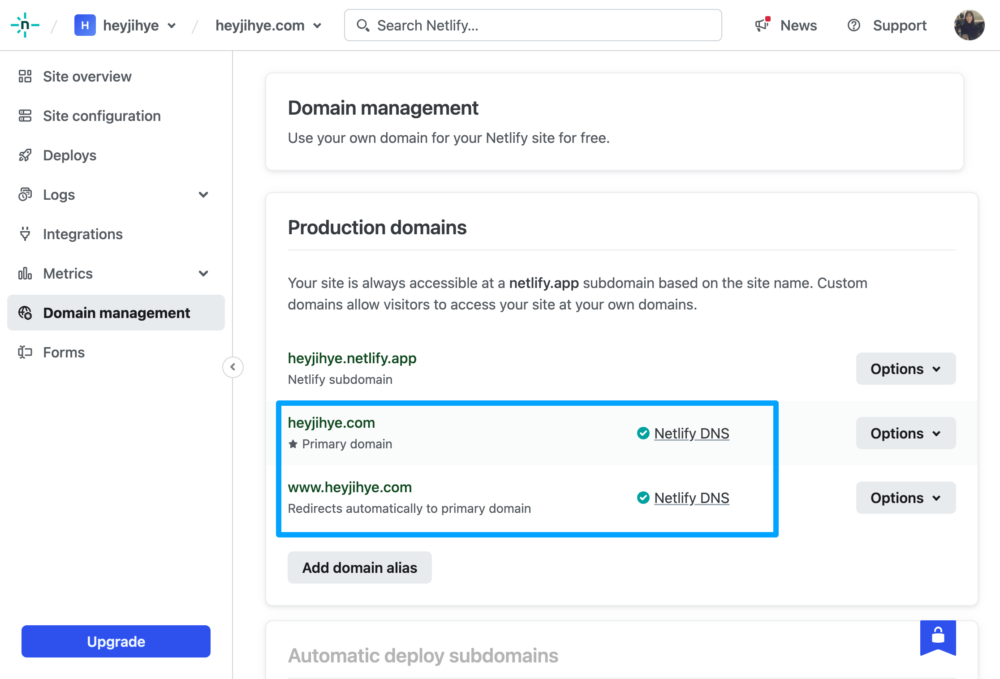

<div className="lead">
이 웹사이트는 Gatsby JS로 만들었고 Gatsby Cloud를 통해 호스팅되고 있었어요.
Gatsby Cloud 서비스 종료에 맞춰 Netlify로 호스팅 서비스를 변경한 과정을 정리해서 소개할게요.
</div>


---

## 배포 플랫폼 Gatsby Cloud 서비스 종료



9월부터 사용하지 않던 Netlify로부터 Gatsby Cloud 서비스 종료 이메일을 몇 개 받았어요.

Netlify 공식 블로그의 공지 글 "[Netlify Announces the Evolution of Cloud Platform](https://www.netlify.com/blog/gatsby-cloud-evolution/)"을 볼까요.
1. Netlify는 2023년 2월에 Gatsby를 인수했어요.
2. Netlify와 Gatsby Cloud는 비슷한 서비스이기 때문에 효율화를 위해 Gatsby Cloud 서비스를 종료해요. (2023년 9월부터, 가격 정책에 따라 순차적으로)
3. Gatsby 웹사이트를 배포 플랫폼에 쉽게 배포할 수 있게 도와주는 새로운 Adapter 기능을 발표했어요. (2023년 8월 [Gatsby v5.12 릴리즈](https://www.gatsbyjs.com/docs/reference/release-notes/v5.12))

저는 무료 사용자라 2023년 9월 29일 전에 다른 배포 서비스로 변경해야 했어요.

---

## Gatsby Cloud에서 사용한 기능 및 설정
서비스 변경 전에 현재 웹사이트에서 사용하고 있는 Gatsby Cloud 전용 기능과 설정을 살펴볼게요.

1. **리다이렉트** 1개: HTTP 리다이렉트를 위해 [`createRedirect`](https://www.gatsbyjs.com/docs/reference/config-files/actions/#createRedirect) 함수를 사용했어요.

    <p className="code-label code-label-ts">gatsby-node.ts</p>

    ```ts{numberLines: true}
    import type {GatsbyNode} from "gatsby"

    export const createPages: GatsbyNode["createPages"] = async ({actions, graphql}) => {
        const {createRedirect} = actions
        createRedirect({
            fromPath: `/`,
            toPath: `/blog`,
        })
    }
    ```

2. Gatsby Cloud 서비스 가입
3. Gatsby Cloud 프로젝트 생성 및 GitHub 저장소와 연동
4. **배포 전용 브랜치** 설정 및 **자동 빌드** 기능 사용
    
5. **커스텀 도메인** 설정
    

배포를 위한 핵심 기능만 사용했기 때문에 설정이 간단해요.
한번 설정하면 소스 코드를 배포 전용 브랜치에 업데이트 할 때마다 자동으로 Gatsby Cloud에서 배포를 진행해요.

이 설정을 그대로 유지하면서 Netlify로 배포 플랫폼을 변경하기 위해 **Gatsby Cloud에서 브랜치 푸시 자동 빌드 기능을 먼저 꺼둡니다.**


---

## Netlify로 배포 플랫폼 변경하기

Gatsby 웹사이트를 Netlify로 배포하기 위해선 소스코드와 Netlify 서비스 설정이 모두 필요해요. 하나씩 살펴볼게요.

1. Gatsby 버전 업데이트

    다양한 플랫폼에 배포하기 위한 새 기능 Adapter가 포함된 최신 버전인 [Gatsby v5.12](https://www.gatsbyjs.com/docs/reference/release-notes/v5.12)를 설치해요.
    gatsby 패키지 뿐만 아니라 플러그인도 모두 함께 업데이트되었어요.
    저는 [npm-check-updates](https://www.npmjs.com/package/npm-check-updates)를 사용해서 `package.json` 파일에 명시된 버전을 업데이트하고 패키지를 설치했어요.

    <p className="code-label">"gatsby"로 시작하는 패키지 최신버전 확인하기</p>

    ```shell{numberLines: false}
    ncu "/^gatsby.*$/"
    ```

    <p className="code-label">"gatsby"로 시작하는 패키지 최신버전을 `package.json` 파일에 업데이트하고 패키지 설치하기</p>

    ```shell{numberLines: false}
    ncu "/^gatsby.*$/" -u
    npm install
    ```

    

2. Gatsby 공식 [`gatsby-adapter-netlify`](https://www.npmjs.com/package/gatsby-adapter-netlify) 플러그인 설치 및 설정

    Gatsby가 공식 지원하는 배포 플랫폼을 사용한다면 관련 아답터 패키지를 설치하고 설정하지 않아도 자동으로 진행돼요.
    (참고 [Zero-Configuration Deployments](https://www.gatsbyjs.com/docs/how-to/previews-deploys-hosting/zero-configuration-deployments/))
    하지만 패키지 설치와 설정을 명시하면 배포 속도가 향상됩니다. 저는 Netlify를 계속 사용할 예정이기 때문에 아답터 설치 및 설정을 진행했어요.

    <p className="code-label code-label-shell">gatsby-adapter-netlify 설치하기</p>

    ```shell
    npm install gatsby-adapter-netlify
    ```

    패키지를 설치했다면 gatsby-config.ts 파일에 아답터 설정을 해주세요.

    <p className="code-label code-label-typescript">gatsby-config.ts 아답터 명시하기</p>

    ```typescript
    import type {GatsbyConfig} from "gatsby";
    import adapter from "gatsby-adapter-netlify"

    const config: GatsbyConfig = {
        adapter: adapter(),
        ...
    }
    ```

    Gatsby는 다양한 배포 플랫폼에 배포할 수 있어요.
    현재 아답터 플러그인은 Netlify뿐이지만 자유롭게 `gatsby-adapter-*` 플러그인을 제작할 수 있기 때문에 시간이 가면 하나씩 늘어날 거에요.

    👍기존에 리다이렉트를 위해 사용하던 함수도 아답터가 처리하기 때문에 변경이 필요 없어요.

3. Netlify 서비스 가입
4. Netlify 프로젝트 생성 및 GitHub 저장소와 연동
5. **배포 전용 브랜치** 설정 및 **자동 빌드** 기능 사용

    배포 전용 브랜치는 `main`으로 설정되어 있어요. 저는 `deploy` 브랜치를 사용해서 변경해주었어요.

    

    배포 브랜치에 PR을 만들면 자동으로 프리뷰를 확인할 수 있어요. GitHub PR 댓글이나 Netlify 배포 페이지에서 확인 할 수 있어요.

    

6. **운영 배포** 확인

    프리뷰에서 문제가 없다면 PR 머지를 진행해요. 그러면 운영 환경에 배포가 진행됩니다. 저는 **heyjihye.netlify.app** 도메인에 잘 배포된 것을 확인했어요.
    만약 서브도메인으로 사용한 사이트 이름이 마음에 들지 않는다면 변경할 수 있어요.

    

7. **커스텀 도메인** 설정

    Netlify에서 커스텀 도메인을 생성해요.
    그리고 도메인을 구입한 서비스에서 DNS 레코드 값을 Gatsby Cloud 설정값에서 Netlify 설정값으로 변경해요.

    

    수정 후 5분이 되지 않아 연결이 완료되었어요.

    

    ⚠️ Netlify는 Netlify 서브도메인(xxx.netlify.app)을 커스텀 도메인으로 리다이렉트 하는 기능을 웹사이트에서 제공하지 않아요.
    이를 위해서는 소스코드 변경이 필요해요. static 폴더에 `_redirects` 파일 생성하고 내용을 추가해요.

    <p className="code-label">static/_redirects</p>

    ```
    https://heyjihye.netlify.app/* https://heyjihye.com/:splat 301!
    ```

---

## 후기

👩‍💻Gatsby Cloud 서비스 종료와 함께 대체할 수 있는 Netlify를 공식 지원하기 때문에 배포 플랫폼 변경은 어렵지 않게 진행했어요.
그럼에도 불구하고 새 서비스를 사용하는 것은 많은 가이드를 익혀야 하는 일로 시간이 꽤나 걸리는 일이에요.

개인 웹사이트를 운영하면서 이전에 **커스텀 도메인**을 설정하길 정말 잘했다는 생각이 들었어요.
그러지 않았다면 배포 서비스 따라 웹사이트 주소가 변경되면서 처리해야 할 일이 훨씬 늘었을 거에요.
구글 서치 콘솔, 구글 애널리틱스 등 관련 서비스도 다시 등록 해야 하는데 기존에 쌓였던 검색엔진 상위 노출 점수도 분명히 무용지물이 되었겠죠. 😱
개인 웹사이트라도 계속 운영할 생각이 있다면 꼭 커스텀 도메인을 등록하길 추천해요.

---

## 참고 자료

이 글을 쓰기 위해 참고한 자료는 아래와 같아요. 📚🤓🕯️

* [Gatsby v5.12 Release Notes](https://www.gatsbyjs.com/docs/reference/release-notes/v5.12/)
* [Gatsby Docs: createRedirect](https://www.gatsbyjs.com/docs/reference/config-files/actions/#createRedirect)
* [Gatsby Docs: Zero-Configuration Deployments](https://www.gatsbyjs.com/docs/how-to/previews-deploys-hosting/zero-configuration-deployments/)
* [gatsby-adapter-netlify](https://www.npmjs.com/package/gatsby-adapter-netlify)
* [Netlify](https://www.netlify.com/)
* [Netlify Blog: Netlify Announces the Evolution of Cloud Platform](https://www.netlify.com/blog/gatsby-cloud-evolution/)
