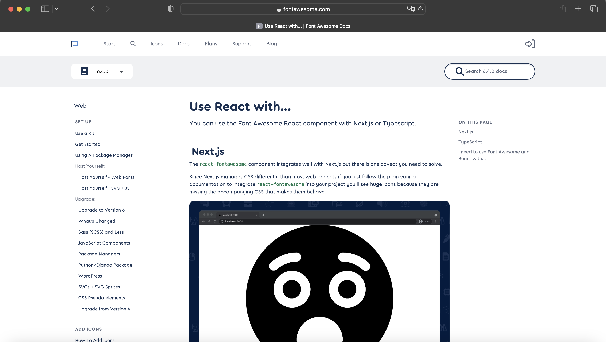
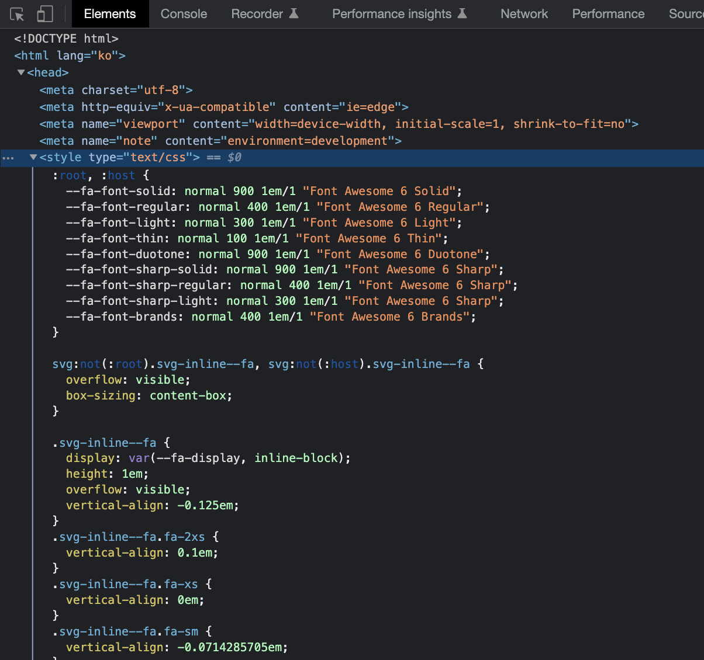
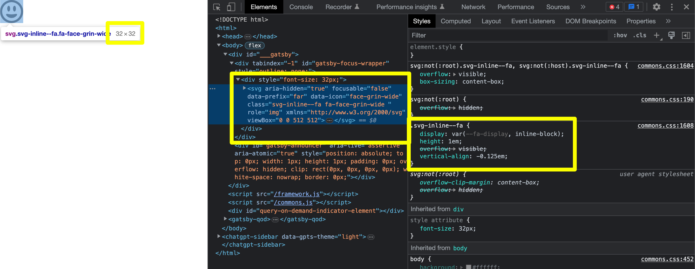
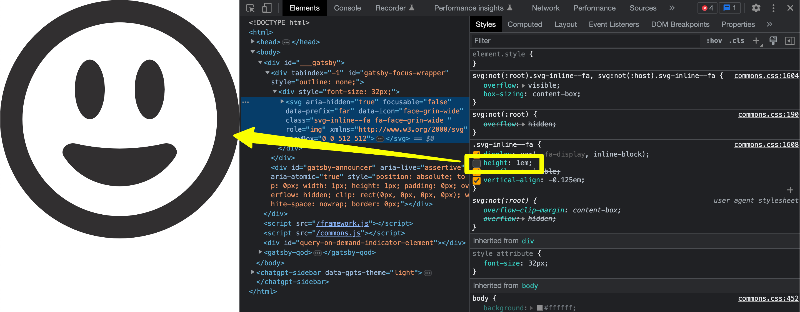
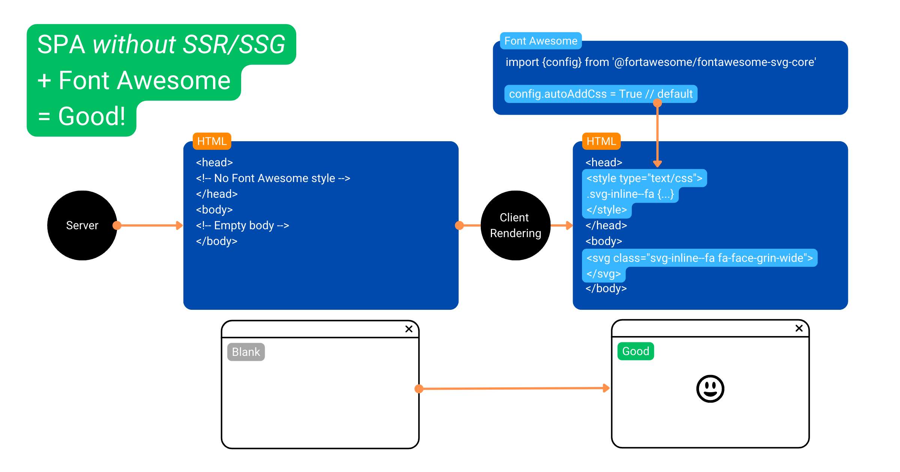
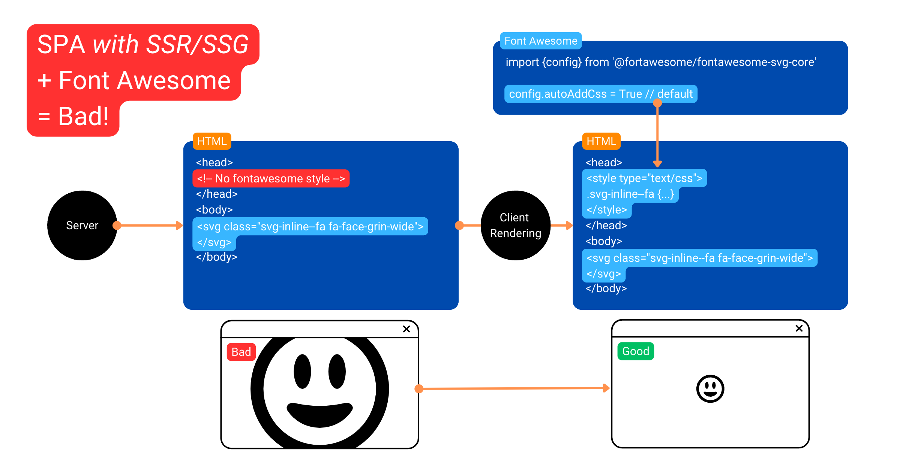
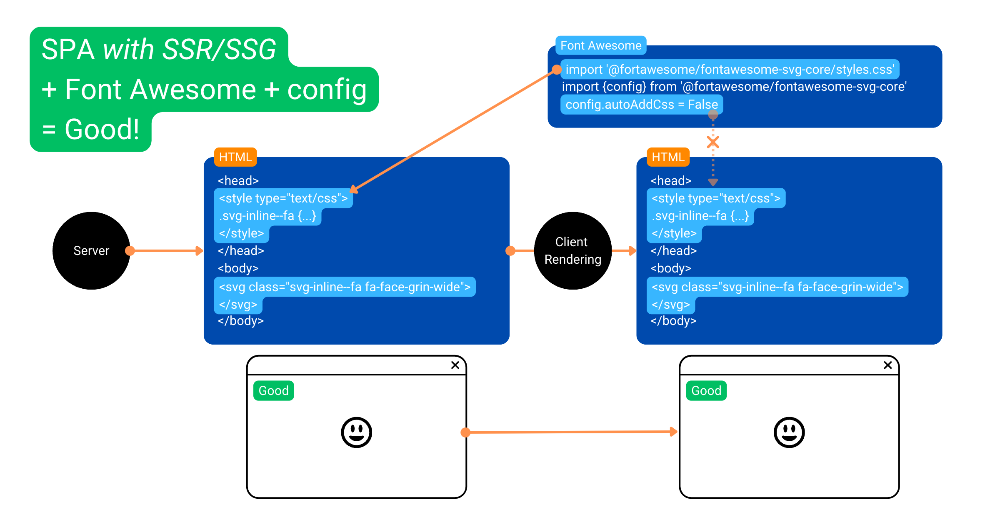
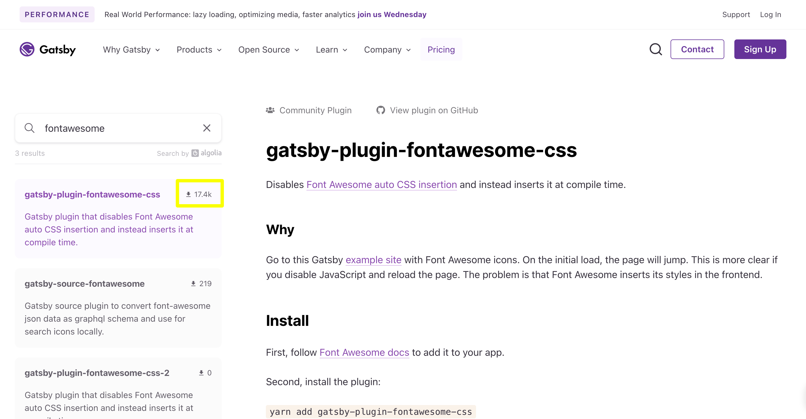

import {faFontAwesomeFlag} from "@fortawesome/free-solid-svg-icons";


<div className="lead">
배포한 웹사이트를 방문했더니 엄청나게 큰 Font Awesome 아이콘이 생겼다 사라지는 걸 봤게나요?
Gatsby 웹사이트에서 Font Awesome 아이콘을 사용할 때 필수로 설정해야 할 코드를 빼먹었군요. 😅
</div>

---

## 준비물

* 💜 **Gatsby v5 웹사이트**: Gatsby로 만든 웹사이트가 필요해요. 없다면 먼저 Gatsby 웹사이트를 만들어 보세요. → [Gatsby Quick Start](https://www.gatsbyjs.com/docs/quick-start/)
* <FontAwesomeIcon icon={faFontAwesomeFlag} style={{color: '#538dd7'}}/> **Font Awesome v5-6 사용**: React 용 패키지를 설치하고 관련 컴포넌트를 사용해야 해요. -> [Font Awesome with React](https://fontawesome.com/v6/docs/web/use-with/react)

[//]: # (todo 테스트 패키지 버전 쓰기)

---

## 문제: 웹사이트 첫 화면에서 Font Awesome 아이콘이 매우 컸다가 작아져요


이 문제는 아래와 같은 환경에서 확인할 수 있어요.

1. **`FontAwesomeIcon`** 컴포넌트를 페이지에 포함하고 있어야 해요.
    <p className={'p-small'}>💁‍♀️ CSS `content`로 구현한 아이콘에는 발생하지 않는 버그에요.</p>

    <p className="code-label code-label-tsx">src/pages/example.tsx</p>

    ```tsx{numberLines: true}
    import React from 'react';
    import {FontAwesomeIcon} from '@fortawesome/react-fontawesome';
    import {faFaceGrinWide} from '@fortawesome/free-solid-svg-icons';

    const ExamplePage = () => {
        return (
            <div style={{fontSize: '32px'}}>
                <FontAwesomeIcon icon={faFaceGrinWide}/>
            </div>
        );
    };
    export default ExamplePage;
    ```

2. **production 모드**로 빌드 후 서버를 실행해요.
    <p className={'p-small'}>💁‍♀️ develop 모드에서는 확인할 수 없어요.</p>

    <p className="code-label code-label-shell"></p>

    ```shell
    gatsby build && gatsby serve
    ```

3. 실행된 서버의 주소를 **웹 브라우저에서 확인**해요.
    ```
    http://localhost:9000/example/
    ```

4.  첫 페이지에 Font Awesome 아이콘이 있다면 현상을 바로 확인할 수 있어요. (=**첫 방문** 시 확인 가능)<br/>
    만약 다른 페이지에 아이콘이 있다면 그 페이지로 이동 후 **새로고침** 해요.
    <p className={'p-small'}>💁‍♀️ 웹페이지가 로딩된 후 내부에서 링크로 이동하면 현상을 확인할 수 없어요.</p>

---

## 해결: 아이콘을 정상 크기로 만들자


### Next.js 웹사이트에 적용하기


이 문제의 해결법은 Font Awesome 공식 홈페이지의 [Use React with...페이지의 **Next.js** 섹션](https://fontawesome.com/v6/docs/web/use-with/react/use-with#next-js)에서 찾을 수 있어요.

React로 개발하고 Next.js 프레임워크를 사용한 경우 생기는 문제이며 이 경우에 아래의 간단한 설정으로 해결된다고 안내하고 있네요.

<p className="code-label code-label-js">pages/_app.js에 위 3줄을 추가해 주세요</p>

```js{numberLines: true}
import '@fortawesome/fontawesome-svg-core/styles.css'
import { config } from '@fortawesome/fontawesome-svg-core'
config.autoAddCss = false

export default function MyApp({ Component, pageProps }) {
  return <Component {...pageProps} />
}
```

---

### Gatsby 웹사이트에 적용하기

Gatsby 웹사이트에서 문제를 해결하는 방법은 Next.js 때와 동일해요.
1. 만약 프로젝트 루트에 `gatsby-browser.tsx` 파일이 없다면 만들고,
2. 이 파일에 동일한 코드 3줄을 추가하면 됩니다.

<p className="code-label code-label-tsx">gatsby-browser.tsx</p>

```tsx{numberLines: true}
import '@fortawesome/fontawesome-svg-core/styles.css'
import { config } from '@fortawesome/fontawesome-svg-core'
config.autoAddCss = false
```

---

## 원인: 왜 이런 문제가 생길까?

Gatsby 프레임워크는 React 기반이죠.
React 프로젝트에서 Font Awesome 아이콘을 사용하려면 `@fortawesome/react-fontawesome` 패키지를 사용해요.
Next.js도 Gatsby와 같은 React 프레임워크이고요.
둘 다 서버 측 랜더링(이하 SSR) <SideBySide>Server-side Rendering</SideBySide>과 정적 사이트 생성(이하 SSG) <SideBySide>Static Site Generation</SideBySide> 기능을 제공하는데 이것 때문에 문제가 발생해요.
하나씩 알아볼게요.

### react-fontawesome 패키지가 아이콘 크기를 조정하는 방식

1. Font Awesome CSS 코드는 동적으로 웹사이트에 추가돼요. 여기에는 아이콘 크기를 조정하는 스타일도 포함돼요.
    

2. `FontAwesomeIcon` 컴포넌트는 `svg` 태그로 변환됐고 `svg-inline--fa` 클래스를 갖고 있어요. `width`, `height` 같은 크기 속성은 없네요.
    

3. 아이콘의 크기는 `svg-inline--fa` 클래스 스타일에서 `height: 1em;`를 적용받아 부모 요소의 폰트 크기와 동일한 크기로 보여요.

    <p className="code-label code-label-css">Font Awesome CSS 일부</p>

    ```css{numberLines: true}
    .svg-inline--fa {
        display: var(--fa-display, inline-block);
        height: 1em;
        overflow: visible;
        vertical-align: -0.125em;
    }
    ```

4. `height: 1em;` 스타일이 없다면 `svg`아이콘이 원본 크기로 보이는 것을 확인할 수 있어요.
    

---

### 정상: React 프로젝트 + SSR/SSG 미설정
React 웹사이트인데 SSR이나 SSG를 설정하지 **않았다면** 문제 되지 않아요.
Gatsby나 Next.js는 SSR/SSG를 지원하지만, **develop 모드**에서 서버를 실행할 때는 SSR, SSG는 실행 하지 않기 때문에 문제 되지 않아요.

이 경우에는 **Font Awesome 스타일이 `head` 내부에 추가되는 시점과 `svg` 아이콘이 `body` 내부에 추가되는 시점이 동일**해요.



---

### 오류: React 프로젝트 + SSR/SSG 설정

React 웹사이트에서 **SSR, SSG를 설정하면 production 모드로 빌드** 할 때 각 HTML 페이지에 내부 내용을 포함해요.
그래서 **Font Awesome 아이콘도 `svg` 요소로 변환해서 포함**됐죠.
그런데 **이 HTML 문서에는 Font Awesome 스타일은 포함되지 않아요.**
그래서 웹사이트 첫 로딩 때 크기 설정이 되지 않은 아이콘이 보였다가 스타일이 나중에 추가되어서 정상 크기로 변경되는 것이 눈에 보이게 돼요.



---

### 정상: React 프로젝트 + SSR/SSG 설정 + Font Awesome 설정

[Gatsby 웹사이트에 적용하기](#gatsby-웹사이트에-적용하기)에서 언급한 설정을 소스에 추가면 **어긋났던 시점이 다시 맞춰져서** 아이콘의 급격한 크기 변경 현상이 없어져요.

1. `config.autoAddCss` 설정값을 `false`로 하면 **브라우저에서 React 웹사이트가 초기화될 때 Font Awesome 스타일이 `head`에 추가되지 않아요.**

    <p className="code-label code-label-tsx">gatsby-browser.tsx</p>

    ```tsx{numberLines: true}
    import { config } from '@fortawesome/fontawesome-svg-core'
    config.autoAddCss = false
    ```

2. `@fortawesome/fontawesome-svg-core/styles.css` 파일을 직접 임포트하면 **빌드할 때 Font Awesome 스타일이 `head`에 추가돼요.**
    이 CSS 파일 내용은 `autoAddCss` 설정으로 추가되는 스타일과 동일한 내용이에요.

    <p className="code-label code-label-tsx">gatsby-browser.tsx</p>

    ```tsx{numberLines: true}
    import '@fortawesome/fontawesome-svg-core/styles.css'
    ```



---

## 불필요한 해결법: gatsby-plugin-fontawesome-css 플러그인 사용하기



`gatsby-plugin-fontawesome-css` 플러그인은 현재(2023년 4월 기준) 2년 넘게 업데이트되지 않고 있지만
Gatsby Plugins 사이트에 따르면 1만 7천 번 이상 다운로드된 인기 있는 플러그인이에요.

이 플러그인은 Font Awesome 아이콘 크기 버그 해결만을 위한 단순한 플러그인이에요.
아래 이유로 이 플러그인을 사용하지 말아야 해요.

1. 가장 중요한 이유는 **공식 문서의 해결 방법이 이미 명확하고 쉽기 때문**이에요.
2. 이 플러그인은 Gatsby 5 버전 이상 환경에 설치 시 **의존성 버전이 맞지 않아**서 `--force` 옵션으로 설치해야 해요.
3. 플러그인 내용을 보면 공식 문서의 해결 방법보다 **훨씬 복잡**하게 Font Awesome 스타일을 추가하고 있어요.

    <p className="code-label code-label-js">[gatsby-ssr.js](https://github.com/jzabala/gatsby-plugin-fontawesome-css/blob/master/gatsby-ssr.js) + [utils.js](https://github.com/jzabala/gatsby-plugin-fontawesome-css/blob/master/utils.js)</p>

    ```js
    // import '@fortawesome/fontawesome-svg-core/styles.css'
    // 위 코드와 동일한 효과를 위해 아래의 코드를 사용한다.

    const React = require('react')
    const { dom } = require('@fortawesome/fontawesome-svg-core')

    let styleTag = null
    exports.onRenderBody = ({ setHeadComponents }) => {
        if (!styleTag) {
            styleTag = React.createElement('style', {
                key: 'gatsby-plugin-fontawesome-css',
                type: 'text/css',
                dangerouslySetInnerHTML: { __html: dom.css() },
            })
        }
        setHeadComponents([styleTag])
    }
    ```

---

## 참고 자료

* Font Awesome v6 Docs: [Use with React - Next.js](https://fontawesome.com/v6/docs/web/use-with/react/use-with#next-js)
* Font Awesome v5 Docs: [Use with React - Next.js](https://fontawesome.com/v5/docs/web/use-with/react#next-js)
* Gatsby Plugins: [gatsby-plugin-fontawesome-css](https://www.gatsbyjs.com/plugins/gatsby-plugin-fontawesome-css/)
