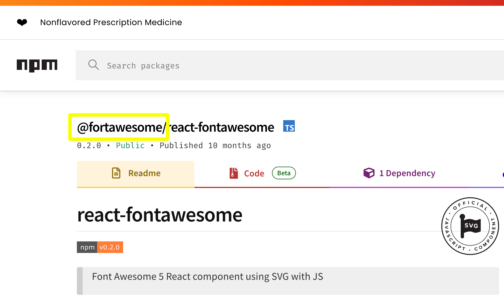

import {faFortAwesome, faFontAwesome} from "@fortawesome/free-brands-svg-icons";
import {faFontAwesomeFlag} from "@fortawesome/free-solid-svg-icons";


<div className="lead">
Gatsby 웹사이트에서 유명한 아이콘 패키지인 Font Awesome을 사용하는 방법을 알려줄게요.
</div>

---

## 준비물

* 💜 **Gatsby v5 웹사이트**: Gatsby로 만든 웹사이트가 필요해요. 없다면 먼저 Gatsby 웹사이트를 만들어 보세요. → [Gatsby Quick Start](https://www.gatsbyjs.com/docs/quick-start/)
* <FontAwesomeIcon icon={faFontAwesomeFlag} style={{color: '#538dd7'}}/> **Font Awesome 사용 계획**:
    * **6 버전** 사용: 최신 버전인 6 버전을 사용할 계획이어야 해요. 5 버전과 일부 기능과 선택할 수 있는 아이콘이 달라요. 참고 [Versions of Font Awesome](https://fontawesome.com/versions)
    * **SVG+JS** 방식 사용: 리액트 컴포넌트를 SVG로 변환하는 방식을 사용해요. WebFonts+CSS 방식을 사용하기 위한 설정은 이 글에서 설명하지 않아요. 참고 [Web Fonts vs SVG](https://fontawesome.com/v6/docs/web/dig-deeper/webfont-vs-svg)
    * **무료** 아이콘만 사용: 유료 아이콘을 사용하려면 추가 설정이 필요해요. 이 글에서는 무료 아이콘만 사용해요.

---

## Font Awesome 공식 패키지 설치하기

Font Awesome은 다양한 개발 환경에서 사용할 수 있어요.
그 중 React, Angular, Vue 등 자바스크립트 기반 개발 환경에서 사용할 수 있는 **npm 패키지를 `@fortawesome` 네임스페이스(스코프)로 묶어서 제공**해요.
<br/>🧐 이름을 잘 보면 오타인가 싶지만, 오타가 아니에요. 이와 관련한 재밌는 뒷이야기는 맨 마지막 [Font Awesome? Fort Awesome? 섹션](#font-awesome-fort-awesome)에서 읽어주세요.
만
1. Gatsby는 React 기반이기 때문에 **React 전용** `react-fontawesome` 패키지를 설치해요.

    `FontAwesomeIcon` 컴포넌트로 아이콘을 추가할 수 있게 돼요.

    <p className="code-label code-label-shell"></p>

    ```shell
    npm i @fortawesome/react-fontawesome
    ```

2. SVG 아이콘을 만들기 위한 **핵심 기능**이 있는 `fontawesome-svg-core` 패키지를 설치해요.<br/>
    <span className={'p-small'}>💁‍♀️ 어떤 역할을 하는지 궁금하다면 → [SVG Core](https://fontawesome.com/v6/docs/web/dig-deeper/svg-core)</span>

    <p className="code-label code-label-shell"></p>

    ```shell
    npm i @fortawesome/fontawesome-svg-core
    ```

3. **무료 아이콘용 npm 패키지는 Regular, Solid, Brands 3개**가 있어요. 사용할 아이콘이 속한 패키지만 골라 설치해요.

    <p className="code-label code-label-shell"></p>

    ```shell
    npm i @fortawesome/free-regular-svg-icons
    npm i @fortawesome/free-solid-svg-icons
    npm i @fortawesome/free-brands-svg-icons
    ```

4. package.json 파일을 보면 설치한 모든 Font Awesome 패키지를 확인할 수 있어요. 👍

    <p className="code-label code-label-json">package.json</p>

    ```json
    {
        "dependencies": {
            "@fortawesome/fontawesome-svg-core": "^6.4.0",
            "@fortawesome/free-brands-svg-icons": "^6.4.0",
            "@fortawesome/free-regular-svg-icons": "^6.4.0",
            "@fortawesome/free-solid-svg-icons": "^6.4.0",
            "@fortawesome/react-fontawesome": "^0.2.0"
        }
    }
    ```

---
## 정적 사이트 생성을 위한 추가 설정하기

Gatsby는 정적 사이트 생성기 <SideBySide>Static Site Generator</SideBySide>에요.
웹사이트를 빌드하면 각 웹페이지를 HTML로 만드는데 이 때문에 **Font Awesome 아이콘 이미지가 엄청나게 커지는 버그**가 생겨요.
이를 방지하기 위해 간단한 설정 코드를 추가해야 해요.

💁‍♀️ 이런 문제가 왜 생기는지 추가 설정이 어떻게 이를 바로 잡는지 궁금하다면 → [Font Awesome 아이콘 크기 버그 해결](/blog/gatsby-fontawesome-fix-huge-icons)

1. 만약 프로젝트 루트에 `gatsby-browser.tsx` 파일이 없다면 만들고,
2. 이 파일에 아래 코드 3줄을 추가하면 됩니다.

<p className="code-label code-label-tsx">gatsby-browser.tsx</p>

```tsx{numberLines: true}
import '@fortawesome/fontawesome-svg-core/styles.css'
import { config } from '@fortawesome/fontawesome-svg-core'
config.autoAddCss = false
```

---
## 사용할 아이콘 검색하기

설치가 모두 끝났으니 사용할 아이콘을 골라봐요.

1. 브라우저에서 [Font Awesome 검색 페이지](https://fontawesome.com/search)를 방문해요.
    Font Awesome 아이콘은 Classic, Sharp, Brands 패밀리가 있어요.
    이 중 **Classic 패밀리의 Regular, Solid 스타일과 Brands 패밀리가 무료**이고,
    이전에 설치한 npm 패키지도 이에 맞춰 3개로 나뉘어져 있었죠.

    

2. **아이콘을 검색**하거나 **카테고리를 선택**하세요. **Free 버튼**을 누르면 무료 아이콘만 검색 결과에 나와요.

    

3. 선택한 아이콘 상세 화면에서 **React 탭**을 누르면 3가지 임포트 방식을 볼 수 있어요.
    이 중에서 원하는 **임포트 방식을 선택**한 후에 보이는 코드를 클릭해서 클립보드에 **코드를 복사**할 수 있어요.
    사용하려는 컴포넌트에 **코드를 붙여넣기** 하세요.

    

---
## React 프로젝트에서 Font Awesome 아이콘을 추가하는 3가지 방식

React 프로젝트에서 Font Awesome 아이콘은 `<FontAwesomeIcon>` 컴포넌트를 사용해서 추가할 수 있어요.
여기에 사용할 아이콘을 프로퍼티로 지정하면 되는데, **아이콘 임포트 방식에 따라 3가지** 나뉘어요.
하나의 임포트 방식을 선택하고 프로젝트 전체에서 사용하세요.

---
### Individual Import
가장 일반적이고 **직관적**인 방식이에요.
사용할 아이콘이 속한 npm 패키지에서 아이콘을 임포트하고,
`<FontAwesomeIcon>` 컴포넌트 `icon` 프로퍼티에 값으로 할당해요.

* **장점**: 사용한 아이콘만 임포트하기 때문에 번들이 자연스럽게 **최적화**돼요.
* **단점**: 사용하는 아이콘을 하나씩 임포트하는 게 **번거로울** 수 있어요.
* 💁‍♀️ 저는 추가 설치와 설정이 필요 없는 이 방식을 사용해요.

<p className="code-label code-label-tsx">src/pages/example.tsx</p>

```tsx{numberLines: true}
import React from 'react'
import { FontAwesomeIcon } from '@fortawesome/react-fontawesome'
import { faHandPeace } from '@fortawesome/free-regular-svg-icons'

const ExamplePage: React.FC = () => {
    return (
        <>
            Hello!
            <FontAwesomeIcon icon={faHandPeace}/>
        </>
    );
}
export default ExamplePage
```

---
### Dynamic Import
**Babel Macros 플러그인** 설정을 통해 사용할 아이콘을 일일이 임포트할 필요가 없으면서도
사용한 아이콘만 번들에 포함하도록 자동으로 최적화하는 방법이에요.
`<FontAwesomeIcon>` 컴포넌트 `icon` 프로퍼티에 값으로 `icon()` 함수를 호출해요.

* **장점**: 아이콘을 추가하기 **쉽고** 번들 **최적화도 자동**으로 돼요.
* **단점**: 추가 플러그인을 **설치**하고 설정 파일을 **작성**해야 해요. 설정 방법은 → [Dynamic Icon Importing](https://fontawesome.com/docs/web/use-with/react/add-icons#dynamic-icon-importing)
* 🙅‍♀️공식 문서에서 추천하는 방식이에요.

<p className="code-label code-label-tsx">src/pages/example.tsx</p>

```tsx{numberLines: true}
import React from 'react'
import { FontAwesomeIcon } from '@fortawesome/react-fontawesome'
import { icon } from '@fortawesome/fontawesome-svg-core/import.macro'

const ExamplePage: React.FC = () => {
    return (
        <>
            Hello!
            <FontAwesomeIcon icon={icon({name: 'hand-peace', style: 'regular'})} />
            {/* Old way: <FontAwesomeIcon icon={regular("hand-peace")} /> */}
        </>
    );
}
export default ExamplePage
```

---
### Global Import
**초기화 모듈**에서 사용하는 모든 아이콘을 임포트하고 **라이브러리**에 등록하면,
아이콘을 사용하는 각 컴포넌트에서는 따로 임포트하지 않아도 되는 방식이에요.

* **장점**: 여러 컴포넌트에서 사용하는 아이콘을 **한 번만 임포트**하면 돼요.
* **단점**: 사용할 아이콘을 등록하는 파일과 실제 사용하는 파일이 분리되어 있기 때문에 **관리하기 어려워요.** 사용하지 않는 아이콘을 임포트하면 번들 크기가 커져서 **성능이 저하될 수 있어요.**
* 🙅‍♀️공식 문서에서 추천하지 않는 방식이에요.

gatsby-browser.tsx 사용할 모든 아이콘을 라이브러리에 추가해요.

<p className="code-label code-label-tsx">gatsby-browser.tsx</p>

```tsx{numberLines: true}
import { library } from '@fortawesome/fontawesome-svg-core'
import { fas } from '@fortawesome/free-solid-svg-icons'
import { faHandPeace } from '@fortawesome/free-regular-svg-icons'
import { faTwitter, faFontAwesome } from '@fortawesome/free-brands-svg-icons'

// fas 를 라이브러리에 추가하면 Classic 패밀리의 Solid 스타일에 속한 모든 아이콘을 번들에 포함하게 됩니다.
// 매우 많은 아이콘이 속해 있기 때문에 사용하는 각 아이콘을 추가하기를 권장해요.
library.add(fas, faHandPeace, faTwitter, faFontAwesome)
```

`<FontAwesomeIcon>` 컴포넌트 `icon` 프로퍼티에 값으로 `fa-` 로 시작하는 아이콘 클래스 이름을 작성해요.
클래스는 아이콘 패밀리, 스타일, 이름을 나타내요.

<p className="code-label code-label-tsx">src/pages/example.tsx</p>

```tsx{numberLines: true}
import React from 'react'
import { FontAwesomeIcon } from '@fortawesome/react-fontawesome'
import { icon } from '@fortawesome/fontawesome-svg-core/import.macro'

const ExamplePage: React.FC = () => {
    return (
        <>
            Hello!
            <FontAwesomeIcon icon="fa-regular fa-hand-peace" />
        </>
    );
}
export default ExamplePage
```

---
## Font Awesome? Fort Awesome?




Font Awesome npm 패키지를 설치하는데 `@fortawesome` 글자를 처음 보고 의아했어요.
공식 패키지가 아닌 줄 알았거든요. 😅
혹시 악성코드인가 싶기도 했고요.

프로젝트 공식 이름은 Font Awesome이 맞지만 이를 **관리하는 조직 이름은 Fort Awesome**(=멋진 요새)가 맞아요.
이름에 대한 유래는 2023년인 지금으로부터 8~9년 전 프로젝트 개발자인 Dave Gandy가 인터뷰한 기사에서 이유를 찾을 수 있었어요.
<br/><span className='p-small'>기사 전문을 보려면 → [Awesome Q&A With Font Awesome Developer Dave Gandy](https://www.impresspages.org/awesome-q-a-with-font-awesome-developer-dave-gandy)</span>


90년대 후반에 한 TV 쇼에서 출연진이 이 이름을 언급했어요.
> 특별한 이름을 가진 무릉도원 같은 집을 갖고 싶었어요. 그래서 **Fort Awesome**이라고 불렀죠.

Dave Gandy는 추운 겨울 하버드 대학교 캠퍼스를 걷는데 학생들이 골판지 상자로 만든 요새에 "Fort Awesome"이라고 적은 것을 보았대요. 🏰📦❄️
이후 그가 사는 모든 집을 "Fort Awesome"이라고 부르고 직접 찍은 골판지 요새 사진을 걸어 두었어요.


자연스럽게 Font Awesome 깃헙 프로젝트 조직도 <FontAwesomeIcon icon={faFortAwesome} /> "**Fort Awesome**"이라고 부르게 되었고요.
여기에서 글자 하나를 바꾼 <FontAwesomeIcon icon={faFontAwesome} /> "**Font Awesome**"이 아이콘 프로젝트의 이름이 되었어요.


---
## 참고 자료

이 글을 쓰기 위해 참고한 자료는 아래와 같아요. 📚🤓🕯️

* [Font Awesome](https://fontawesome.com)
* [Versions of Font Awesome](https://fontawesome.com/versions)
* Font Awesome v6 Docs: [Set Up with React](https://fontawesome.com/v6/docs/web/use-with/react)
* Font Awesome v6 Docs: [Use with React - Next.js](https://fontawesome.com/v6/docs/web/use-with/react/use-with#next-js)
* Font Awesome v6 Docs: [Add Icons with React](https://fontawesome.com/docs/web/use-with/react/add-icons)
* Font Awesome v6 Docs: [Web Fonts vs SVG](https://fontawesome.com/v6/docs/web/dig-deeper/webfont-vs-svg)
* Font Awesome v6 Docs: [SVG Core](https://fontawesome.com/v6/docs/web/dig-deeper/svg-core)
* npm: [@fortawesome/react-fontawesome](https://www.npmjs.com/package/@fortawesome/react-fontawesome)
* npm: [@fortawesome/fontawesome-svg-core](https://www.npmjs.com/package/@fortawesome/fontawesome-svg-core)
* ImpressPages Blog: [Awesome Q&A With Font Awesome Developer Dave Gandy](https://www.impresspages.org/awesome-q-a-with-font-awesome-developer-dave-gandy)
