<div className="lead">
Google 애널리틱스 설치가 필요한가요? `gtag.js` 로 직접 설치하지 말고 Google 태그 관리자를 이용해 설치하면 더 좋아요.
**Google 태그 관리자를 웹사이트에 한 번 설치**하면 이후에는 GA4 등 Google 태그뿐만 아니라 다른 외부 태그도 **웹에서 쉽게 설치하고 관리**할 수 있어요.
</div>

---
## 준비물

* 💜 **Gatsby v5 웹사이트**: Gatsby로 만든 웹사이트가 필요해요. 없다면 먼저 Gatsby 웹사이트를 만들어 보세요. → [Gatsby Quick Start](https://www.gatsbyjs.com/docs/quick-start/)
* 👩‍🎓 **Google 태그 관리자에 대한 지식**: Google 태그 관리자(GTM)에 대해 알고 있어야 해요. → [Google 태그 관리자][tagmanager]

---
## Google 태그 관리자를 왜 사용 하나요?
웹사이트를 개발하면 웹 분석을 위해 Google 애널리틱스, 카카오 픽셀, 페이스북 픽셀 등 각종 외부 서비스를 많이 사용해요.
이를 위해 각 서비스에서 제공하는 코드 스니펫(태그)를 웹사이트 코드에 추가해야 하죠.
**Google 태그 관리자 <SideBySide>Google Tag Manager, GTM</SideBySide>를 이용하면 이런 태그를 웹 코드에 직접 작성하지 않고 태그 관리자 웹사이트에서 설정할 수 있어요.**

Google 태그 관리자를 사용하면 아래와 같은 **장점**이 있어요.
- 각종 태그 설치 및 수정을 **웹 UI**로 편하게 관리 🏷️
- 웹 개발 소스 코드와 외부 서비스 코드를 **분리** 👩‍💻
- **버전** 관리 및 쉬운 **복구** 기능 😅
- **미리보기** 및 **디버깅**의 편리성 🔍
- 퍼포먼스 마케터 등 웹 개발자가 아닌 사람이 태그를 직접 관리 가능 👩‍💻🧑🏻‍💼👨🏽‍💼

---

## Google 태그 관리자에서 컨테이너 만들기
Gatsby 웹사이트에 Google 태그 관리자를 설치하려면 먼저 **컨테이너**를 만들어야 해요.
컨테이너는 **각종 태그를 묶어주는 관리 단위**에요.
보통 웹사이트라면 **웹사이트 당 1개 컨테이너**를 만들면 돼요.

컨테이너는 **계정에 속해야** 해요. a)새 계정에 새 컨테이너를 만들거나, b)기존 계정에 새 컨테이너를 만들 수 있어요.
브라우저에서 [Google 태그 관리자 홈페이지][tagmanager]로 이동 후 계정 생성 여부에 따라 아래 내용을 따라 하세요.

### 새 계정에 새 컨테이너 만들기

새 컨테이너가 속할 계정이 없다면 **새 계정**을 함께 만들어요. **계정 만들기 버튼**은 아래 두 화면에서 찾을 수 있어요.

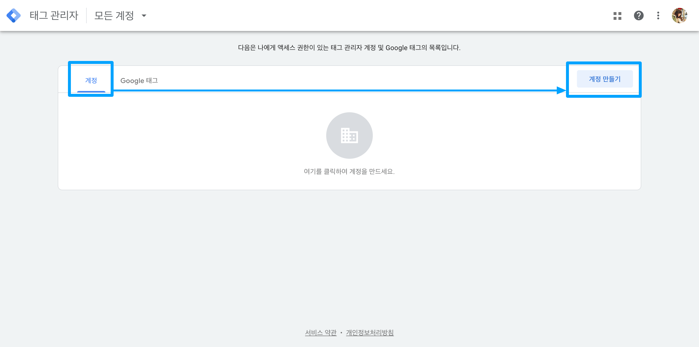
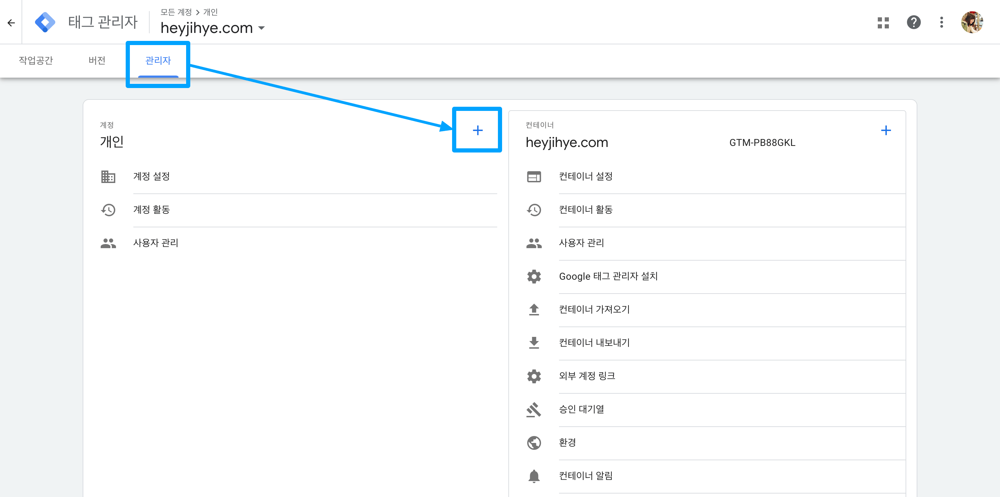

계정 만들기 화면에서 **계정 설정 정보를 입력**해요.
회사 프로젝트라면 회사 이름으로 만들면 돼요. 저는 개인용 웹사이트를 관리하려고 '개인' 이름으로 계정을 만들었어요.

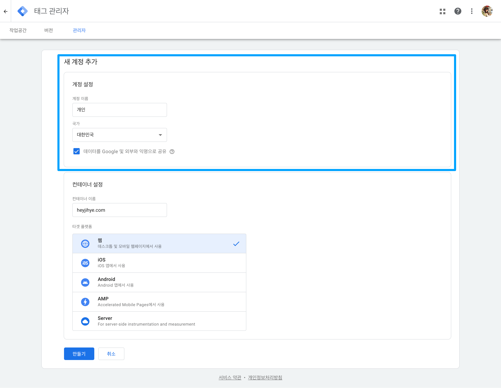

계정 만들기 화면에서 **컨테이너 설정 정보도 함께 입력**해요. 이름을 입력하고 플랫폼을 웹으로 선택했어요.

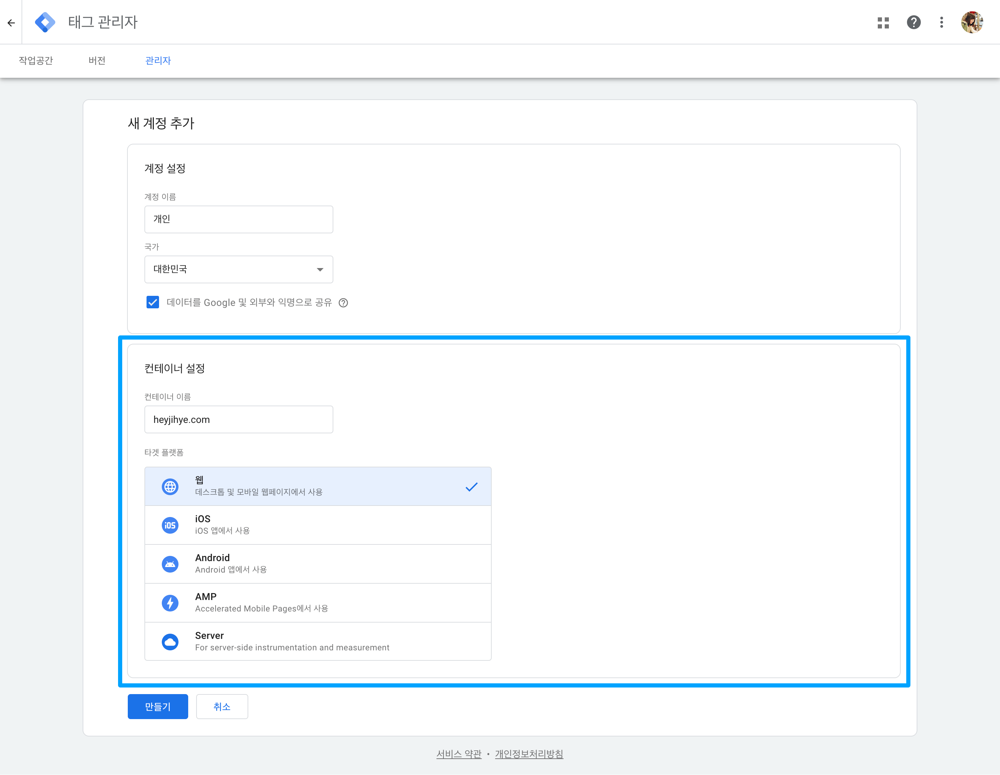

### 기존 계정에 새 컨테이너 만들기
이미 새 컨테이너가 속할 계정이 있다면 바로 새 컨테이너를 만들 수 있어요.
**컨테이너 만들기 버튼**은 아래 두 화면에서 찾을 수 있어요.

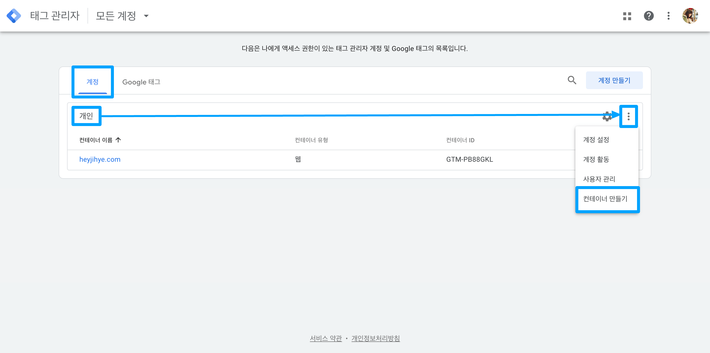
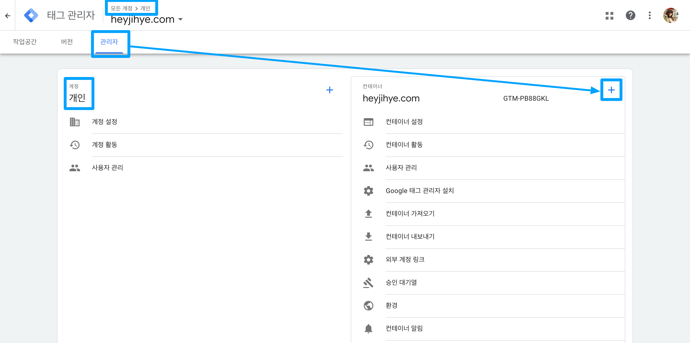

컨테이너 만들기 화면에서 **컨테이너 설정 정보를 입력**해요.
이름을 입력하고 플랫폼을 웹으로 선택했어요.

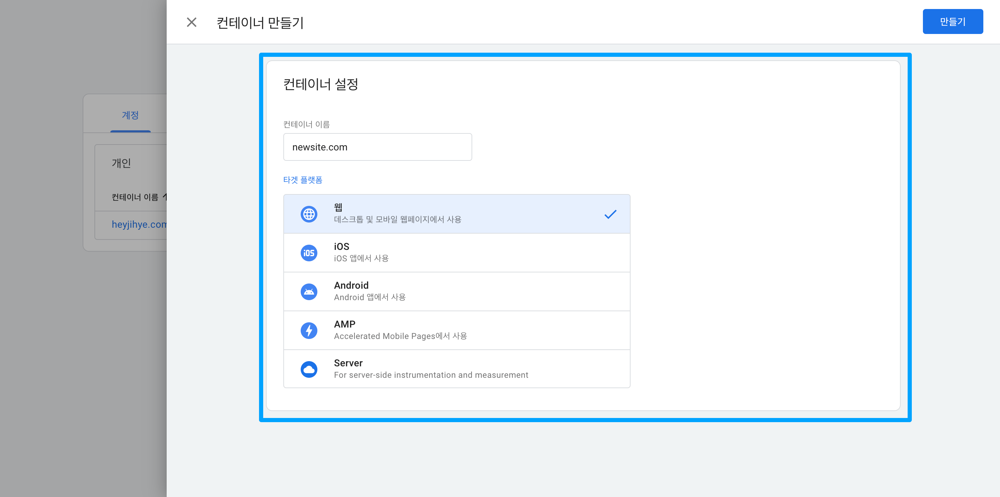

---

## Gatsby 웹사이트에 Google 태그 관리자 설치하기
컨테이너를 만들었다면 Gatsby 웹사이트에 **GMT 설치 코드**를 `<head>` 요소와 `<body>` 요소에 추가해야 해요.
설정 방식이 단순하기 때문에 **의존성을 줄이기 위해 직접 추가하는 것을 추천**해요. ⭐️
gatsby-plugin-google-tagmanager 플러그인을 사용해서 설치하는 방법도 소개할게요.

---
### Gatsby 웹사이트에 GTM 스니펫 추가하기

1. Gatsby `siteMetadata`에 컨테이너 ID 값을 담을 `gtm` 속성 추가하기

    각종 설정값을 `siteMetadata`에 모아 관리하면 유지보수하기 쉬워요. 👍 GTM 컨테이너 ID 값도 여기에 추가해요.

    <p className="code-label code-label-typescript">gatsby-config.ts</p>

    ```typescript
    import type {GatsbyConfig} from 'gatsby';

    const config: GatsbyConfig = {
        siteMetadata: {
            gtm: 'GTM-XXXXXXX', // 컨테이너 ID
        },
    };
    ```

2. `useSiteMetadata` 함수 내부 쿼리문에 `gtm` 필드 추가하기

    웹사이트 메타 정보를 GraphQL 쿼리로 읽어와서 데이터를 쉽게 사용할 수 있는 함수를 대부분 Gatsby 웹사이트에서 이미 사용하고 있을 거예요.
    여기에 1)에서 만든 `gtm` 필드를 추가해요.

    <p className="code-label code-label-tsx">src/hooks/use-site-metadata.tsx</p>

    ```tsx{numberLines: true}
    import {graphql, useStaticQuery} from "gatsby"

    export const useSiteMetadata = () => {
        const {site} = useStaticQuery<Queries.siteMetadataQuery>(graphql`
            query siteMetadata {
                site {
                    siteMetadata {
                        title
                        description
                        image
                        siteUrl
                        author
                        gtm
                    }
                }
            }
        `)
        return site!.siteMetadata!
    }
    ```

3. Google 태그 관리자 설치 코드 얻기

    **설치 코드**는 선택한 컨테이너 페이지의 아래 두 위치에서 찾을 수 있어요.

    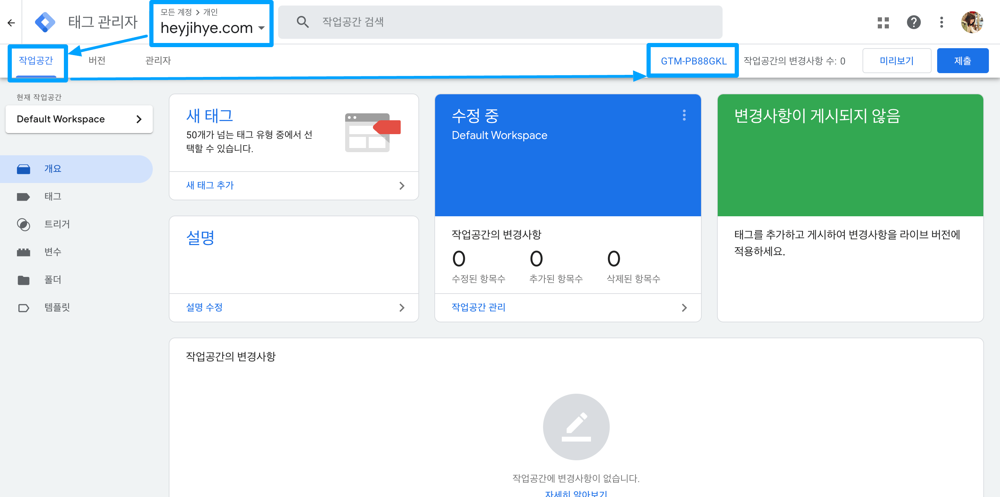
    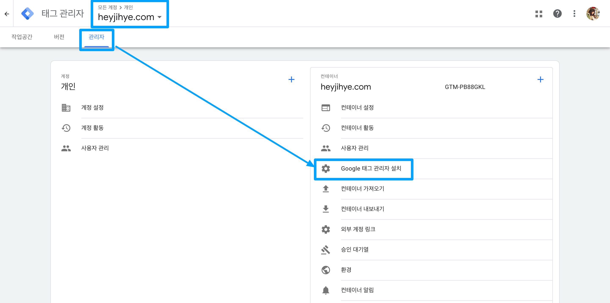

    Google 태그 관리자 설치 코드를 확인해요.
    `<head>` 요소에 GTM `<script>` 요소를 추가하고 `<body>` 요소에 `<noscript>` 요소를 추가해야 해요.

    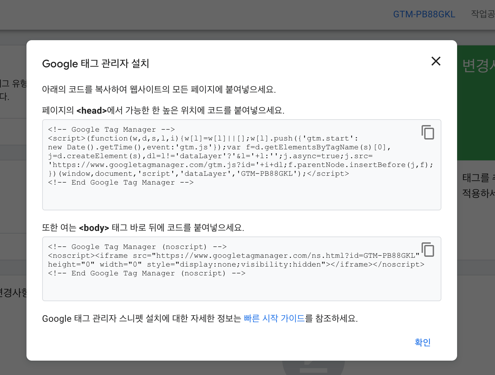

4. 셋업용 컴포넌트 만들기

    GTM 설치 코드를 담을 파일을 생성하고 3)에서 얻은 두 개의 요소를 추가해요.
    하드코딩 되어 있는 컨테이너 ID를 1,2)에서 얻은 `gtm` 변수로 대체해요.

    <p className="code-label code-label-tsx">src/components/gtm-setup.tsx</p>

    ```tsx{numberLines: true}
    import React from "react"
    import {oneLine} from "common-tags";
    import {useSiteMetadata} from "../hooks/use-site-metadata";

    const {gtm} = useSiteMetadata()

    // Google Tag Manager
    export const gtmScript = <script
        key="gtm-js"
        dangerouslySetInnerHTML={{__html: oneLine`
            (function(w,d,s,l,i){w[l]=w[l]||[];w[l].push({'gtm.start':
            new Date().getTime(),event:'gtm.js'});var f=d.getElementsByTagName(s)[0],
            j=d.createElement(s),dl=l!='dataLayer'?'&l='+l:'';j.async=true;j.src=
            'https://www.googletagmanager.com/gtm.js?id='+i+dl;f.parentNode.insertBefore(j,f);
            })(window,document,'script','dataLayer','${gtm}');
    `}}/>

    // Google Tag Manager - noscript
    export const gtmNoscript = <noscript
        key="gtm-noscript"
        dangerouslySetInnerHTML={{__html: oneLine`
            <iframe src="https://www.googletagmanager.com/ns.html?id=${gtm}" height="0" width="0" style="display:none;visibility:hidden"></iframe>
    `}}/>
    ```

5. `onRenderBody` 설정하기

    4)에서 만든 설치 코드를 불러와서 `gatsby-ssr.tsx` 파일의 `onRenderBody` 함수 내용에 추가하면 끝이에요. 🎉

    <p className="code-label code-label-tsx">gatsby-ssr.tsx</p>

    ```tsx{numberLines: true}
    import * as React from "react"
    import {GatsbySSR} from "gatsby"
    import {gtmNoscript, gtmScript} from "./src/components/gtm-setup";


    export const onRenderBody: GatsbySSR["onRenderBody"] = ({ setHeadComponents, setPreBodyComponents }) => {
        setHeadComponents([gtmScript])
        setPreBodyComponents([gtmNoscript])
    }
    ```

---

### gatsby-plugin-google-tagmanager 플러그인 사용하기

[Gatsby Plugins][gatsby plugin] 페이지에서 `google`로 검색하면 공식 플러그인 3개가 상단에 나와요.
이 중 Google 태그 관리자를 설치하는 [`gatsby-plugin-google-tagmanager`][tagmanager plugin] 플러그인이 가장 인기가 많네요.

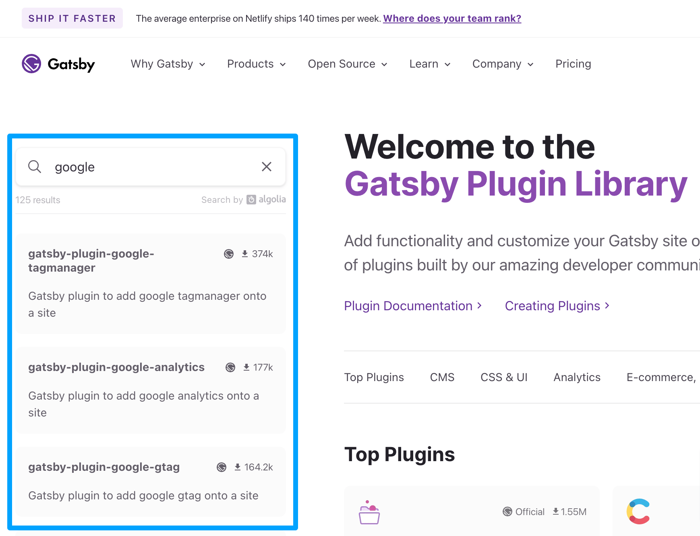

1. 먼저 플러그인을 설치해요.

    <p className="code-label code-label-shell"></p>

    ```shell
    npm install gatsby-plugin-google-tagmanager
    ```

2. 플러그인이 설치되었다면 `gatsby-config.ts` 파일에 플러그인 이름과 옵션을 함께 추가해요.

    <p className="code-label code-label-typescript">gatsby-config.ts</p>

    ```typescript
    import type {GatsbyConfig} from 'gatsby';

    const config: GatsbyConfig = {
        plugins: [
            {
                resolve: 'gatsby-plugin-google-tagmanager',
                options: {
                    id: 'GTM-XXXXXXX', // 컨테이너 ID
                    includeInDevelopment: true,  // 개발 서버로 Google Tag Assistant 사용하려면 true로 설정.
                }
            },
        ]
    };

    export default config;
    ```

---

## Google Tag Assistant 미리보기로 GTM 설치 확인하기

어떤 방식으로든 Google 태그 관리자 코드를 추가했다면 Google 태그 관리자 웹사이트에서 바로 확인해 봐요.

1. **로컬 개발 서버**를 실행해요.

    <p className="code-label code-label-shell"></p>

     ```shell
    gatsby develop
    ```

2. Google 태그 관리자 웹사이트의 해당 컨테이너 페이지에서 **미리보기** 버튼을 눌러요.

    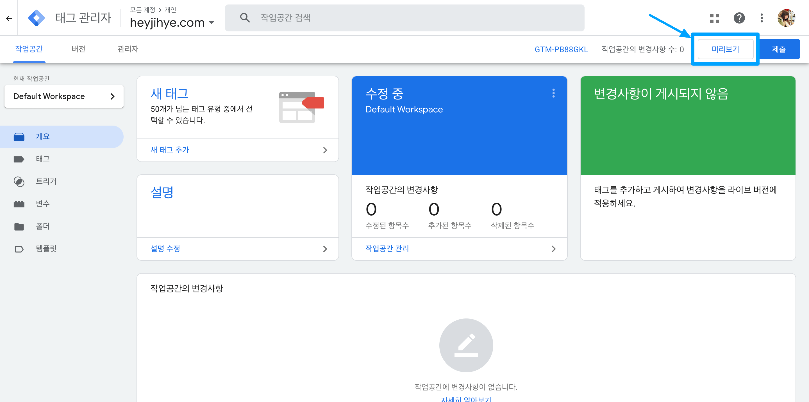

3. **Google Tag Assistant** 페이지에서 `http://localhost:8000` 개발 서버 주소를 입력하고 `Connect` 버튼을 눌러요.

    

4. 웹페이지가 **디버그 UI**로 변경돼요. Summary에서 `1 Initialization` 영역을 클릭하면 GTM 코드가 초기화된 것을 확인할 수 있어요. 🎉

    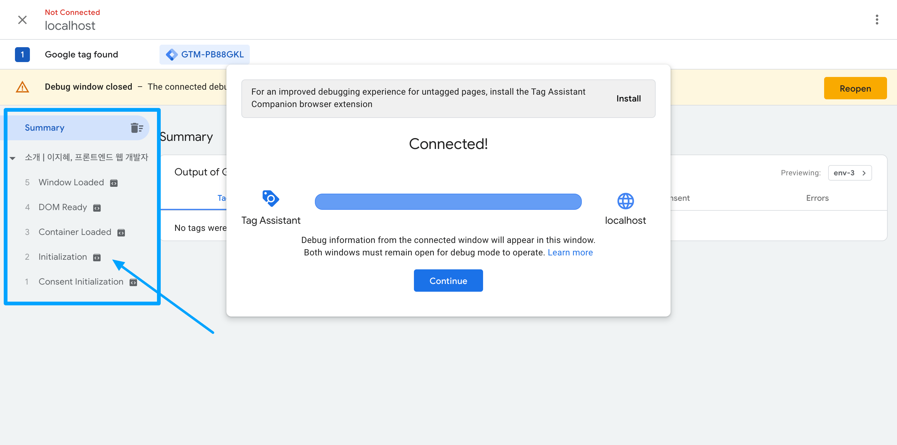
---

## 참고 자료

이 글을 쓰기 위해 참고한 자료는 아래와 같아요. 📚🤓🕯️

* [Google Tag Manager Help Center](https://support.google.com/tagmanager)
* Gatsby Plugins: [gatsby-plugin-google-tagmanager][tagmanager plugin]

[tagmanager]: https://tagmanager.google.com/
[gatsby plugin]: https://www.gatsbyjs.com/plugins/
[tagmanager plugin]: https://www.gatsbyjs.com/plugins/gatsby-plugin-google-tagmanager/
