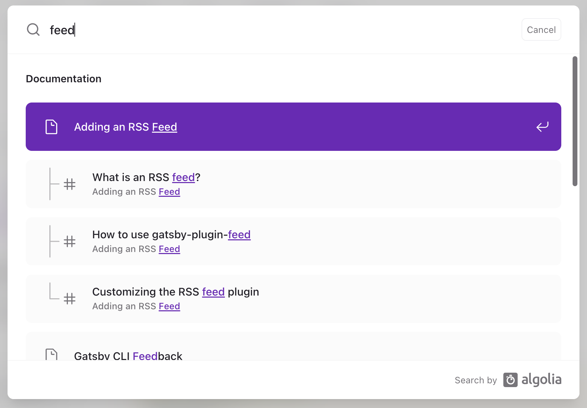
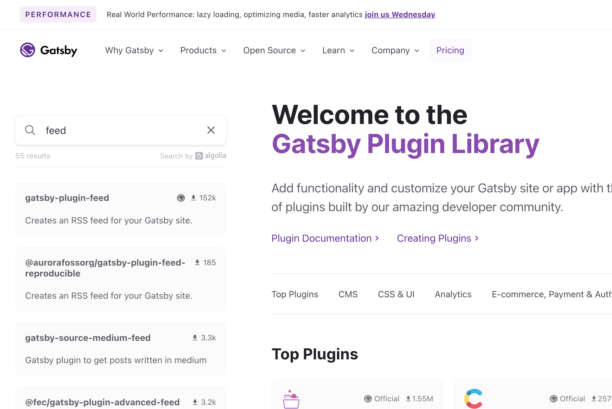

<div className="lead">
Gatsby 블로그에 gatsby-plugin-feed를 사용해 RSS 피드를 추가하는 방법을 설명한다.
</div>

---

## 준비물

* **RSS 개념 및 명세에 대한 지식**: RSS의 개념과 피드 구성 요소는 다음 글에서 설명한다. → [RSS 피드](/blog/rss-feed)
* **Gatsby 웹사이트**: Gatsby로 만든 웹사이트가 필요하다. 프로젝트 생성 방법은 다음 문서를 참고한다. → [Gatsby Quick Start](https://www.gatsbyjs.com/docs/quick-start/)
* **콘텐츠**: 블로그 포스트나 기사, 팟캐스트 등 계속 발행하는 콘텐츠가 있어야 한다.

 예시는 **타입스크립트**로 작성했다.
자바스크립트에서는 예시의 타입 정보를 제거해 사용한다.

---

## Gatsby 웹사이트에 RSS 피드 추가하기

기능을 추가하기 위해 [Gatsby 공식 홈페이지](https://www.gatsbyjs.com/)에서 얻을 수 있는 정보가 있는지 확인한다.


1. **공식 문서 읽기**: 사이트에서 "feed"로 검색하니 관련 공식 문서 [Adding an RSS Feed](https://www.gatsbyjs.com/docs/how-to/adding-common-features/adding-an-rss-feed/)가 있다.
    공식 플러그인 **gatsby-plugin-feed**를 사용해서 RSS 피드를 만드는 법을 설명하고 있다.

    

2. **플러그인 검색하기**: [Gatsby Plugins](https://www.gatsbyjs.com/plugins/) 페이지에서 "feed"로 검색하니 50개가 넘는 플러그인이 있다.
    가장 위 **gatsby-plugin-feed** 플러그인이 가장 많이 사용하는 공식 플러그인이다. 이 플러그인을 사용한다.

    

<GoogleAdPostMiddle/>

## gatsby-plugin-feed 활용

[gatsby-plugin-feed](https://www.gatsbyjs.com/plugins/gatsby-plugin-feed/) 플러그인은 **RSS 2.0** 버전 피드를 생성한다. <br/>
 만약 Atom/JSON 피드 형식이 필요하다면 플러그인 검색 결과에 나온 다른 플러그인을 살펴본다.

* RSS 피드 파일을 생성한다.
    * 이를 위해 노드 패키지 [rss](https://www.npmjs.com/package/rss)를 사용한다.
* 모든 웹페이지의 `head` 요소에 피드 파일을 가리키는 `link` 요소를 추가한다.
* production 모드에서만 실행된다.

---

### 플러그인 설치

먼저 플러그인을 설치한다.

```shell
npm install gatsby-plugin-feed
```

---

### gatsby-config.ts에 사용 설정하기

플러그인이 설치되었다면 `gatsby-config.ts` 파일에 플러그인 이름과 옵션을 함께 추가한다.

```typescript title="gatsby-config.ts"
import type {GatsbyConfig} from 'gatsby';

const config: GatsbyConfig = {
    plugins: [
        {
            resolve: 'gatsby-plugin-feed',
            options: {
                query: `...`,
                setup: (options: {}) => ({}),
                feeds: [{...}, ]
            }
        },
    ]
};

export default config;
```

설정 옵션은 다음 3가지다.
* **query**: 기본 쿼리문을 작성한다. 각 피드에서 공통으로 사용할 데이터를 얻기 위해 사용할 수 있다.
* **setup**: 쿼리 데이터와 설정값을 받아서 RSS 피드 객체를 반환하는 함수를 작성한다. 여러 피드에 공통으로 사용할 채널 정보를 설정할 수 있다.
* **feeds**: 한 개 혹은 그 이상의 피드 객체를 배열에 담는다. 피드는 각각 RSS XML 파일로 만들어진다.

---

### 블로그용 피드 예시

다음 구조의 Gatsby 블로그를 기준으로 설정 예시를 설명한다. <br/>
전체 코드는 [여기](https://github.com/designmeme/personal-website/blob/main/samples/rss-feed-gatsby-config.ts)서 볼 수 있다.

1. 블로그 포스트 파일은 **파일시스템**으로 읽어온다.

    ```typescript title="gatsby-config.ts 파일에서 plugins 배열에 설정 추가"
    {
        resolve: 'gatsby-source-filesystem',
        options: {
            "name": "posts",
            "path": `./src/posts/`
        },
    },
    ```

2. 블로그 포스트 파일은 **MDX** 포맷을 사용한다.

    ```typescript title="gatsby-config.ts 파일에서 plugins 배열에 설정 추가"
    {
        resolve: 'gatsby-plugin-mdx',
        options: {},
    },
    ```

3. 블로그 포스트는 아래와 같은 **frontmatter** 정보를 가진다.

    ```mdx title="각 포스트의 MDX 파일의 frontmatter 예시"
    ---
    slug: gatsby-rss
    title: RSS 피드 추가하기
    categories: [Web Dev, 웹개발, Programming]
    image: ../images/post/gatsby-rss.png
    createdAt: 2023-04-21T00:00:00+09:00
    updatedAt: 2023-04-22T12:00:00+09:00
    ---
    ```

4. 블로그 포스트 웹페이지 **주소**는 frontmatter 정보의 slug 값을 사용한다.

    웹페이지 주소: `/blog/{post.frontmatter.slug}`

---

#### 옵션 query 설정하기

**기본 쿼리문**을 작성한다. 각 피드에서 공통으로 사용할 데이터를 얻기 위해 사용할 수 있다.

```typescript title="gatsby-config.ts query 설정 예시"
import type {GatsbyConfig} from 'gatsby';

const siteUrl: string = `https://heyjihye.netlify.app`
const title: string = `이지혜, 프론트엔드 개발자`

const config: GatsbyConfig = {
    siteMetadata: {
        title,
        description: `Freelance Front-end Web Developer`,
        siteUrl,
        author: `이지혜`,
        email: `ghe.lee19@gmail.com`,
        lang: `ko`,
        categories: ['Tech', 'Web Dev', '웹개발', 'Programming', '개발블로그'],
        copyright: `© 2017-${(new Date()).getFullYear()} 이지혜 All rights reserved.`,
    },
    plugins: [
        {
            resolve: 'gatsby-plugin-feed',
            options: {
                query: `
                  {
                    site {
                      siteMetadata {
                        description
                        siteUrl
                        categories
                        copyright
                        email
                        author
                        language: lang
                      }
                    }
                  }
                `,
                // defaultOptions.setup 과 동일한 내용
                // defaultOptions https://github.com/gatsbyjs/gatsby/blob/master/packages/gatsby-plugin-feed/src/internals.js
                setup: ({ query: { site: { siteMetadata }}, ...feed }) => ({
                    ...siteMetadata,
                    ...feed,
                }),
                feeds: [{
                    serialize: ({ query: { site: { siteMetadata } }}) => []
                }, ]
            }
        },
    ]
};

export default config;
```

* 채널과 아이템 정보로 쓸 `siteMetadata` 쿼리문을 작성한다.
* 쿼리 데이터는 옵션 `setup`과 각 피드의 `serialize` 함수에서 인자로 받아 사용할 수 있다.
* 키 이름은 [rss](https://www.npmjs.com/package/rss) 패키지의 [feedOptions](https://www.npmjs.com/package/rss#feedoptions) 요소와 동일하다면 그대로 채널 하위 요소로 사용된다.
  * 예시에서  `description`, `categories` 등은 자동으로 피드의 채널 하위 요소 `description`, `category`로 만들어진다.

---


#### 옵션 setup 설정하기

쿼리 데이터와 설정값을 받아서 **RSS 피드 객체를 반환**하는 함수를 작성한다.
여러 피드에 공통으로 사용할 채널 정보를 설정할 수 있다.<br/>
[defaultOptions](https://github.com/gatsbyjs/gatsby/blob/master/packages/gatsby-plugin-feed/src/internals.js)으로 지정된 함수를 사용하지 않는 경우만 작성하면 된다.

```typescript title="gatsby-config.ts setup 설정 예시"
import type {GatsbyConfig} from 'gatsby';

const config: GatsbyConfig = {
    plugins: [
        {
            resolve: 'gatsby-plugin-feed',
            options: {
                query: `...`,
                // setup 함수 재설정
                setup: ({query: {site: {siteMetadata}}, ...feed}) => ({
                    // 권장형식: username@hostname.tld (Real Name)
                    managingEditor: `${siteMetadata.email} (${siteMetadata.author})`,
                    webMaster: `${siteMetadata.email} (${siteMetadata.author})`,
                    feed_url: siteMetadata.siteUrl + feed.output,  // atom:link 생성용
                    ...siteMetadata,
                    ...feed,
                }),
                feeds: [{
                    output: '/rss.xml',
                    managingEditor: 'setup에서 설정한 managingEditor를 덮어쓸 정보',
                    ...
                }, ]
            }
        },
    ]
};

export default config;
```

`feeds` 배열을 순환하며 `feed`를 인자로 넣어 `setup` 함수를 호출한다.
리턴 받은 피드 객체는 노드 패키지 `rss`의 `RSS` 인스턴스를 만드는데 사용한다.

* 옵션 `query`에 작성한 기본 쿼리 데이터를 사용할 수 있다.
* 옵션 `feeds`의 각 피드에 동일하게 작성할 채널 하위 요소를 설정하면 유용하다.
  * 예시의 `feed.output` 등 피드의 모든 객체 데이터를 사용할 수 있다.

<GoogleAdPostMiddle/>

#### 옵션 feeds 설정하기

한 개 혹은 그 이상의 **피드 객체를 배열**에 담는다. 피드는 각각 RSS XML 파일로 만들어진다.

```typescript title="gatsby-config.ts feeds 설정 예시"
import type {GatsbyConfig} from 'gatsby';

const config: GatsbyConfig = {
    plugins: [
        {
            resolve: 'gatsby-plugin-feed',
            options: {
                query: `...`,
                setup: (options: {}) => ({}),
                feeds: [
                    {
                        // 필수
                        // link 요소가 html head에 추가됨.
                        // <link rel="alternate" type="application/rss+xml" href="/rss.xml" title="이지혜, 프론트엔드 개발자">
                        output: "/rss.xml",

                        // 필수
                        title: "이지혜, 프론트엔드 개발자",

                        // match: "^/blog/",

                        // 만들어진 /rss.xml 파일 대신 외부 주소를 사용해 link 요소가 html head에 추가됨.
                        // <link rel="alternate" type="application/rss+xml" href="https://feeds.feedburner.com/heyjihye/feed" title="이지혜, 프론트엔드 개발자">
                        // link: "https://feeds.feedburner.com/heyjihye/feed",

                        // feed options: https://www.npmjs.com/package/rss#feedoptions
                        site_url: `${siteUrl}/blog/?utm_source=blog-feed&utm_medium=feed&utm_campaign=feed`,
                        custom_namespaces: {
                            'creativeCommons': 'http://backend.userland.com/creativeCommonsRssModule',
                            'media': 'http://search.yahoo.com/mrss/',
                        },
                        custom_elements: [
                            {'creativeCommons:license': 'https://creativecommons.org/licenses/by-nc-nd/4.0/'},
                        ],

                        // 필수
                        query: `
                          {
                            allPostMdx: allMdx(
                              sort: {frontmatter: {createdAt: DESC}},
                              filter: {fields: {sourceInstanceName: {eq: "posts"}}},
                              limit: 1000,
                            ) {
                              nodes {
                                excerpt(pruneLength: 400)
                                frontmatter {
                                  slug
                                  title
                                  subtitle
                                  categories
                                  date: createdAt
                                  image {
                                    childImageSharp {
                                        gatsbyImageData(layout: FIXED, width: 1200, formats: [WEBP])
                                    }
                                  }
                                }
                              }
                            }
                          }
                        `,
                        // 필수
                        // @ts-ignore
                        serialize: ({query: {site: {siteMetadata}, allPostMdx}}) => allPostMdx.nodes.map(node => {
                            const image = getImage(node.frontmatter.image)
                            const imageSrc = image?.images.fallback?.src

                            // 블로그 포스트만 RSS 피드 아이템으로 생성한다.
                            return Object.assign({}, node.frontmatter, {
                                title: `${node.frontmatter.title} — ${node.frontmatter.subtitle}`,
                                description: node.excerpt,
                                // utm 정보 추가
                                url: `${siteMetadata.siteUrl}/blog/${node.frontmatter.slug}/?utm_source=blog-feed&utm_medium=feed&utm_campaign=feed`,
                                guid: `blog-${node.frontmatter.slug}`,
                                custom_elements: [
                                    image && {
                                        'media:content': [
                                            {
                                                _attr: {
                                                    url: siteMetadata.siteUrl! + imageSrc,
                                                    type: `image/webp`,
                                                    width: image.width,
                                                    height: image.height,
                                                }
                                            }, {
                                                'media:title': [{_attr: {type: 'plain'}}, `<![CDATA[ ${node.frontmatter.title} ]]>`]
                                            }
                                        ]
                                    },
                                ],
                            });
                        }),
                    }
                ]
            }
        },
    ]
};

export default config;
```

각 피드는 **4개 필수 항목**을 가진다.
* **output**: 생성할 파일의 경로 및 이름을 작성한다.
* **title**: 피드 제목을 작성한다.
* **query**: 피드 쿼리문을 작성한다. 피드의 각 아이템을 만들 때 필요한 데이터를 가져와야 한다.
* **serialize**: 공통 쿼리와 피드 쿼리 데이터를 받아서 각 아이템 객체를 반환하는 함수를 작성한다.
  * 키 이름은 [rss](https://www.npmjs.com/package/rss) 패키지의 [itemOptions](https://www.npmjs.com/package/rss#itemoptions) 내용을 참고해서 작성한다.

각 피드는 **2개의 옵션 항목**을 가진다.
* **match**: 각 아이템의 주소(`url`)와 매치하는 것만 포함하도록 하려면 RegExp 문을 작성한다.
* **link**: [피드버너](https://feedburner.google.com/)와 같은 웹 피드 프록시 서비스를 사용한다면 그 주소를 입력한다.

이외 **채널 하위 요소를 추가**할 수 있다.
* 키 이름은 [rss](https://www.npmjs.com/package/rss) 패키지의 [feedOptions](https://www.npmjs.com/package/rss#feedoptions) 내용을 참고해서 작성한다.
* **site_url**: 주소에 UTM을 추가하면 트래픽 분석할 때 유용하다.

---

#### 결과물 확인하기

설정한 결과물을 확인하기 위해 아래 스크립트를 실행한다.

```shell
gatsby build && gatsby serve
```

브라우저에서 `localhost:9000/rss.xml`에 접속하면 피드 파일을 확인할 수 있다.<br/>
전체 코드는 [여기](https://github.com/designmeme/personal-website/blob/main/samples/rss-sample.xml)서 볼 수 있다.

```xml title="rss.xml"
<?xml version="1.0" encoding="UTF-8"?>
<rss xmlns:dc="http://purl.org/dc/elements/1.1/"
     xmlns:content="http://purl.org/rss/1.0/modules/content/"
     xmlns:atom="http://www.w3.org/2005/Atom"
     xmlns:creativeCommons="http://backend.userland.com/creativeCommonsRssModule"
     xmlns:media="http://search.yahoo.com/mrss/"
     version="2.0"
>
    <channel>
        <title><![CDATA[이지혜, 프론트엔드 개발자]]></title>
        <description><![CDATA[Freelance Front-end Web Developer]]></description>
        <link>https://heyjihye.netlify.app/blog/?utm_source=blog-feed&amp;utm_medium=feed&amp;utm_campaign=feed</link>
        <generator>GatsbyJS</generator>
        <lastBuildDate>Fri, 21 Apr 2023 12:26:22 GMT</lastBuildDate>
        <atom:link href="https://heyjihye.netlify.app/rss.xml" rel="self" type="application/rss+xml"/>
        <author><![CDATA[이지혜]]></author>
        <copyright><![CDATA[© 2017-2023 이지혜 All rights reserved.]]></copyright>
        <language><![CDATA[ko]]></language>
        <managingEditor><![CDATA[ghe.lee19@gmail.com (이지혜)]]></managingEditor>
        <webMaster><![CDATA[ghe.lee19@gmail.com (이지혜)]]></webMaster>
        <category><![CDATA[Tech]]></category>
        <category><![CDATA[Web Dev]]></category>
        <category><![CDATA[웹개발]]></category>
        <category><![CDATA[Programming]]></category>
        <category><![CDATA[개발블로그]]></category>
        <item>
            <title><![CDATA[RSS 피드 추가하기 — gatsby-plugin-feed 사용법]]></title>
            <description><![CDATA[준비물 👩‍🎓 RSS 개념 및 명세에 대한 지식: RSS가 무엇인지 혹은 피드에 어떤 내용을 써야 할지 모르겠다면? 이 글을 먼저 읽어보세요. → RSS 피드 💜 Gatsby 웹사이트: Gatsby로 만든 웹사이트가 필요해요. 없다면 먼저 Gatsby 웹사이트를 만들어 보세요. → Gatsby Quick Start 📰 시리즈 콘텐츠: 블로그 포스트나 기사, 팟캐스트 등 계속 발행하는 콘텐츠가 있어야 해요.

💁‍♀️ 예시는 타입스크립트로 작성했어요. 타입스크립트가 아닌 자바스크립트를 사용하나요? 예시에서 타입 정보를 빼고 봐주세요.

Gatsby 웹사이트에 RSS 피드 추가하기

기능을 추가하기 위해 Gatsby…]]></description>
            <link>https://heyjihye.netlify.app/blog/gatsby-rss/?utm_source=blog-feed&amp;utm_medium=feed&amp;utm_campaign=feed
            </link>
            <guid isPermaLink="false">blog-gatsby-rss</guid>
            <category><![CDATA[Web Dev]]></category>
            <category><![CDATA[웹개발]]></category>
            <category><![CDATA[Programming]]></category>
            <pubDate>Sat, 15 Apr 2023 15:00:00 GMT</pubDate>
            <media:content url="https://heyjihye.netlify.app/static/ed2feabf18834a391cd166f4fa104c2a/0d4d1/gatsby-rss.webp"
                           type="image/webp" width="1200" height="630">
                <media:title type="plain">&lt;![CDATA[ RSS 피드 추가하기 ]]&gt;</media:title>
            </media:content>
        </item>
        <item>...</item>
    </channel>
</rss>
```

모든 HTML 파일의 `head` 요소에 피드 파일을 가리키는 `link` 요소가 추가된 걸 확인할 수 있다.

```html title="index.html"
<!DOCTYPE html>
<html lang="ko">
    <head>
        ...
        <link rel="alternate" type="application/rss+xml" title="이지혜, 프론트엔드 개발자" href="/rss.xml"/>
    </head>
    <body>...</body>
</html>
```

---

## 참고 자료

이 글에서 참고한 자료는 다음과 같다.

* Gatsby Docs: [Adding an RSS Feed](https://www.gatsbyjs.com/docs/how-to/adding-common-features/adding-an-rss-feed/)
* Gatsby Plugins: [gatsby-plugin-feed](https://www.gatsbyjs.com/plugins/gatsby-plugin-feed/)
* npm: [rss](https://www.npmjs.com/package/rss)
