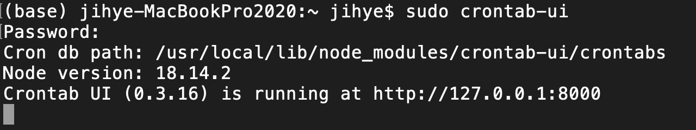

<div className="lead">
하루에 한 번, 매 시간, 특정 요일마다 실행할 스크립트가 점점 늘어나게 되었어요. 📚
클라우드를 사용하지 않고 로컬 컴퓨터에서 직접 실행해도 된다면 Crontab UI를 사용해 쉽게 스케줄 작업을 관리할 수 있어요.
</div>

---
## Crontab UI 소개

[Crontab UI][crontab-ui]는 **`cron` 작업을 웹 UI**로 쉽게 관리할 수 있게 해주는 **노드** 패키지에요.

맥을 사용하면 내장된 `crontab`으로 `cron` 작업을 관리할 수 있지만 터미널을 사용한 명령어 인터페이스에 익숙해야 해요.
Crontab UI를 사용하면 GUI로 편리하게 관리할 수 있어요. 👍

---
## Crontab UI 사용법

### 플러그인 설치

터미널을 열고 `npm` 명령어로 패키지를 설치해요.

<p className="code-label code-label-shell"></p>

```shell
npm install -g crontab-ui
```

<p className="code-label code-label-shell">권한 오류가 발생한다면 sudo 명령어를 앞에 붙여서 실행해요.</p>

```shell
sudo npm install -g crontab-ui
```

### Crontab UI 실행하기

설치가 완료되면 간단한 명령어로 Crontab UI 웹 서버를 실행할 수 있어요.

<p className="code-label code-label-shell"></p>

```shell
crontab-ui
```

<p className="code-label code-label-shell">권한 오류가 발생한다면 sudo 명령어를 앞에 붙여서 실행해요.</p>

```shell
sudo crontab-ui
```



---
### 브라우저에서 크론 작업 등록하기

1. 브라우저에서 `http: //127.0.0.1:8000` 주소로 웹 페이지를 열고 `New` 버튼을 클릭해요.

    

2. 작업 **이름**을 쓰고, **실행할 명령어**를 적어요. 실행할 **스케줄**을 설정하면 Job 입력란에 등록할 `cron` 작업이 미리보기로 보여져요.

    

3. 만든 작업의 `Run now` 버튼을 누르면 바로 스크립트를 실행해요. 작업 생성시 `Enable error logging` 옵션을 체크했다면 에러, 실행 로그도 확인할 수 있어요.
    <br/>정상 작동한다면 `Save to cronjob` 버튼을 눌러 작업 등록을 완료해요.

    

---
### Crontab UI 중단하기

작업 등록, 수정, 삭제를 완료했다면 Crontab UI 웹서버는 필요가 없어요. 터미널에서 `control+C`를 눌러서 웹서버를 중단해요.


---

## 참고 자료

이 글을 쓰기 위해 참고한 자료는 아래와 같아요. 📚🤓🕯️

* GitHub [Crontab UI][crontab-ui]

[crontab-ui]: https://github.com/alseambusher/crontab-ui
