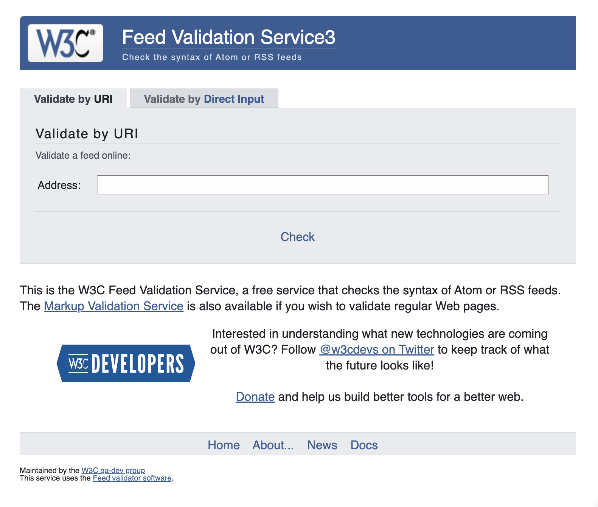
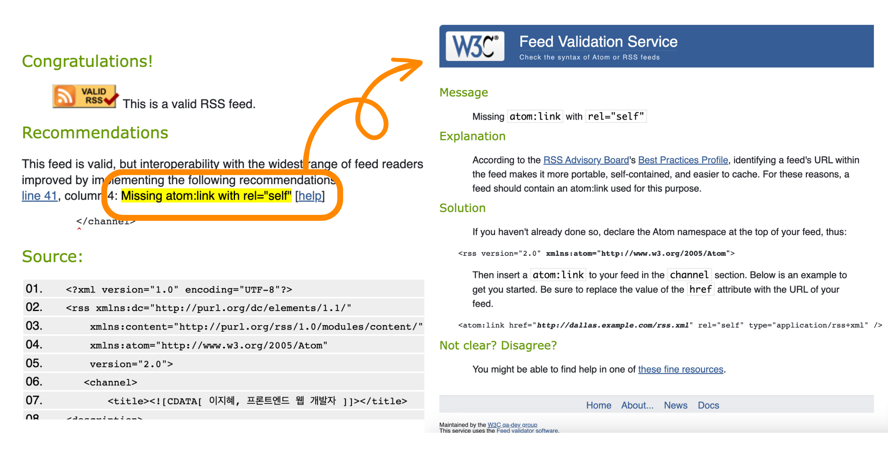
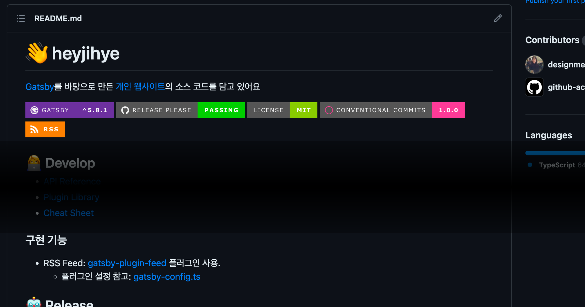
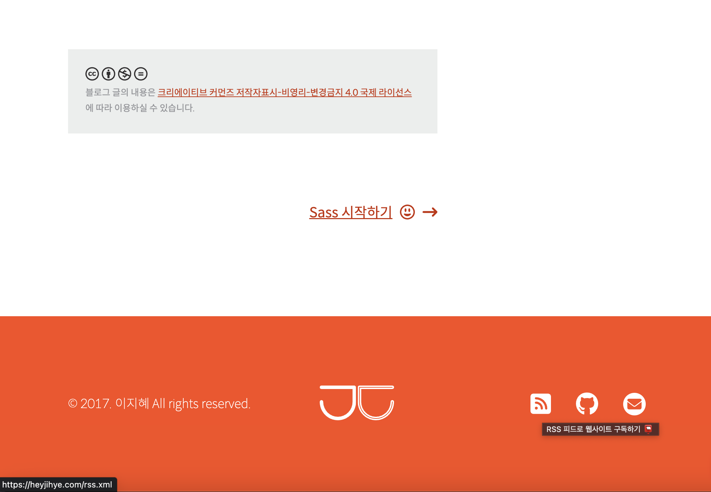
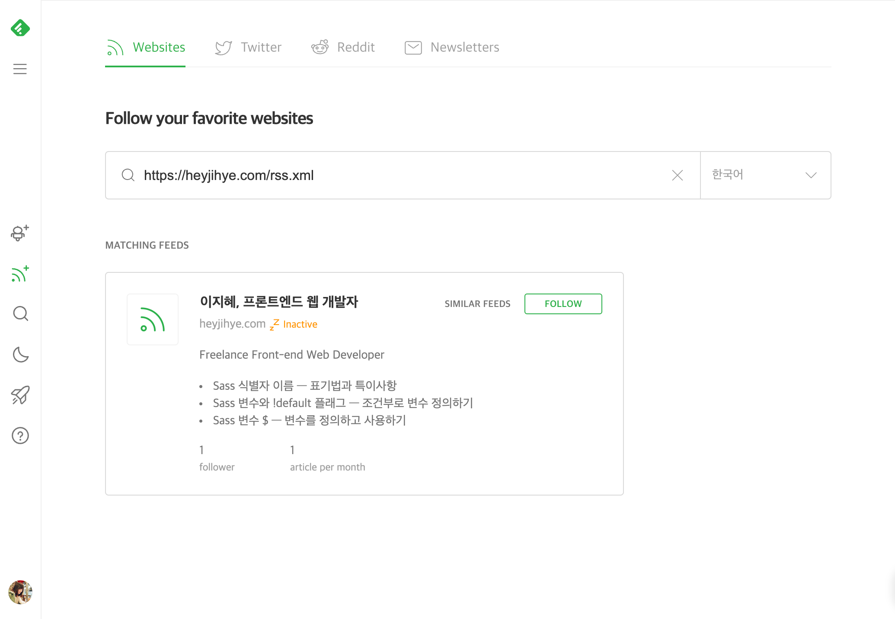
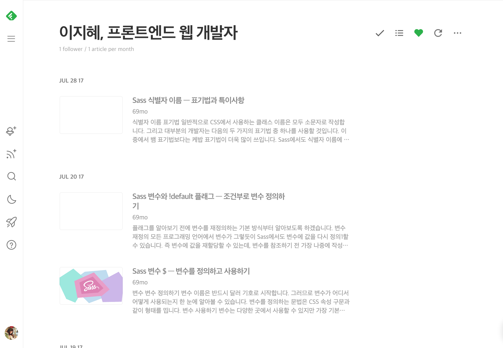

<div className="lead">
뉴스나 잡지의 기사, 블로그의 포스트, 웹소설 등 콘텐츠를 제공하는 웹사이트를 운영한다면 독자를 늘리기 위해 큰 노력을 하죠.
SEO는 물론이고 뉴스레터를 발행하거나 포털 연계, 자체 앱 개발까지 다양한 방법이 있어요.

그중 가장 쉬운 방법은 RSS 피드를 제공하는 것이에요.
웹페이지로 발행한 콘텐츠 목록을 문서 하나로 만들기만 하면 되거든요.
</div>

---

## RSS 피드가 뭐예요?
[RSS 피드](https://en.wikipedia.org/wiki/RSS)(=RSS 채널)은 발행 주체인 채널과 발행한 콘텐츠 정보를 담고 있는 **웹 피드** 중 하나에요.
블로그, 기사, 웹툰, 웹소설, 팟캐스트 등 시리즈 콘텐츠를 발행 즉시 독자/청취자/시청자에게 전달하기 위해 많이 사용해요.

---

### 웹 콘텐츠를 구독하기 위한 표준 웹 피드

[//]: # (![웹 피드가 작동하는 법]&#40;&#41;)

[웹 피드](https://en.wikipedia.org/wiki/Web_feed)는 뉴스 기사처럼 자주 발행되는 콘텐츠를
사용자에게 제공(=웹 신디케이션 Web Syndication)하기 위한 **데이터 포맷**이에요.
컴퓨터가 읽을 수 있는 표준화된 형식이라서 피드를 읽어서 사용자에게 콘텐츠 목록과 내용을 보여주는 **피드 리더**를 개발할 수 있죠.
사용자는 한 피드 리더에서 여러 **웹 피드를 구독**해서 콘텐츠를 모아 볼 수 있어요.
각 웹사이트를 따로 방문해서 새 콘텐츠가 있는지 일일이 확인할 필요가 없어지는 거죠.

---

### 가장 유명한 웹 피드인 RSS 피드
1999년 처음 공개된 RSS 명세는 20년 세월에 걸쳐 조금씩 [개선](https://www.rssboard.org/rss-change-notes)되었으며,
2009년 자 2.0.11 버전을 현재까지 사용하고 있어요.
RSS 대안으로 2005년 만들어진 [Atom](https://datatracker.ietf.org/doc/html/rfc4287),
2017년 만들어진 [JSON Feed](https://www.jsonfeed.org/)도 있지만
웹 피드를 RSS 피드라고 지칭할 만큼 가장 유명하고 널리 쓰이는 포맷이에요.

---

### 웹 피드를 구독하기 위한 도구, 피드 리더

[//]: # (![웹 피드 - 피드 리더가 읽는다]&#40;&#41;)

웹 피드를 구독하고 내용을 확인할 수 있는 앱을 피드 리더라고 해요.
어그리게이터 <SideBySide>Aggregator</SideBySide>, 뉴스 리더 모두 같은 말이라고 보면 됩니다.
피드 리더는 피드 검색, 구독, 콘텐츠 읽기, 저장하기 등 기능을 제공해요.

사용자가 구독한 피드 문서를 정기적으로 확인하면서 사용자가 읽은 콘텐츠 외에 새 콘텐츠가 있는지 확인해 보여줘요.
그 때문에 리더 사용자는 여러 웹사이트를 돌아다니지 않고 새 콘텐츠를 모아서 볼 수 있어요.

[피드 리더](https://en.wikipedia.org/wiki/Comparison_of_feed_aggregators)는 아주 많은데,
대부분 RSS/ATOM 피드 형식을 지원하기 때문에 본인에게 맞는 피드 리더를 사용하면 됩니다.
어떤 피드 리더는 이메일 뉴스레터도 피드 리더에서 구독할 수 있게 하거나, 구독한 채널과 비슷한 채널을 추천하는 등 편리한 부가 서비스를 제공하기도 해요.

---

사용자는 웹 콘텐츠를 편리하게 모아 볼 수 있고, 개발자는 웹사이트 방문과 콘텐츠 소비를 늘릴 수 있는 유용한 도구가 웹 피드입니다.
누이 좋고 매부 좋고, 모두에게 좋은데 심지어 만들기도 간편하답니다.
이제 웹사이트에 RSS 피드를 제공하려면 어떻게 개발해야 하는지 살펴볼게요.

---

## RSS 2.0 명세

[//]: # (![rss 2.0 간단 다이어그램]&#40;&#41;)

[공식 명세](https://validator.w3.org/feed/docs/rss2.html)를 보면 RSS는 Really Simple Syndication의 약자입니다.
이름 그대로 **초간단 웹 콘텐츠 전달**을 위해 만들어졌어요. 문법을 보기 전에 알아야 할 사항은 아래와 같아요.

* **언어**: RSS 피드는 확장 마크업 언어(XML)로 작성해요.
* **버전**: 가장 최신 버전인 2.0(=2.0.x)을 널리 사용해요.
[2.0.11 버전](https://www.rssboard.org/rss-history)은 2009년 3월 20일 배포되었으며
이후 추가할 기능은 RSS 자체가 아니라 XML 네임스페이스 확장으로 구현하고 있어요.
* **확장**: XML 네임스페이스 선언하면 RSS로 구현하지 못하는 정보를 추가할 수 있어요.
* **개수**: 한 웹사이트에 한 개 이상 웹 피드를 제공할 수 있어요.
종합신문사처럼 다양한 분야에서 많은 콘텐츠를 발행한다면 알맞게 분리해서 다수의 웹 피드를 제공하는 게 좋아요.

RSS 피드인 XML 파일을 만들어 봅시다. 파일명은 알맞게 지어주세요.
최상위 태그는 1개의 `rss` 요소입니다. `version` 속성값으로 사용하려는 RSS 버전을 넣어줍니다.

<p className="code-label code-label-xml">rss.xml</p>

```xml
<rss version="2.0">
    ...
</rss>
```

---

### 채널
`rss` 요소는 1개의 `channel` 요소를 가져요. 그러므로 RSS 피드는 곧 채널을 의미하죠.
여러 채널로 콘텐츠를 분리하고 싶다면 여러 RSS 피드 파일로 분할해야 해요.
`channel`은 콘텐츠 발행 채널을 의미하며 채널 정보 및 채널이 발행한 콘텐츠 정보를 포함해요.

<p className="code-label code-label-xml">rss.xml</p>

```xml
<rss version="2.0">
    <channel>...</channel>
</rss>
```

---

#### 채널의 필수 하위 요소 3가지
채널에 대한 정보를 나타내는 필수 요소는 3개에요. 이 RSS 피드가 어떤 콘텐츠 채널에 의해 발행되었는지 알려줘야 해요.

<dl>
<dt>`title`</dt>
<dd>웹사이트 제목 혹은 채널을 구분할 수 있는 이름을 입력해요. 피드 리더에서 그대로 사용자에게 보여요.</dd>
<dt>`link`</dt>는
<dd>채널을 가리키는 웹사이트 주소를 입력해요. 피드 리더에서 채널명 클릭하면 해당 링크로 이동합니다.</dd>
<dt>`description`</dt>
<dd>채널 설명이에요. 피드 리더에서 채널 정보로 보일 수 있어요.</dd>
</dl>

---

#### 채널의 선택 하위 요소 16가지

필수는 아니지만 유용한 선택 요소도 있고 현재 피드 리더가 어떻게 사용하는지 불분명하거나 불필요한 요소도 있어요.
[채널 작성 예시](#채널-작성-예시)를 함께 보면 이해가 쉬울 거예요.

<dl>
<dt>`language`</dt>
<dd>
채널이 사용하는 [언어 코드](https://www.rssboard.org/rss-language-codes)를 입력해요.
`ko`처럼 언어만 쓰거나 `ko-KR`처럼 국가코드를 같이 쓸 수 있어요.
피드 리더에서 언어를 기준으로 피드를 묶어 보여주는 등 기능을 제공할 수 있게 해줍니다.
</dd>

<dt>`copyright`</dt>
<dd>저작권 정보를 입력해요. 피드 리더에서 채널 정보로 보여줄 수 있어요.</dd>

<dt>`managingEditor`</dt>
<dd>콘텐츠 작성자의 이메일 주소를 입력해요. 필수는 아니지만 이름을 괄호 안에 함께 쓰는 것을 추천해요.</dd>

<dt>`webMaster`</dt>
<dd>채널의 기술 책임자 이메일 주소를 입력해요. 필수는 아니지만 이름을 괄호 안에 함께 쓰는 것을 추천해요.</dd>

<dt>`pubDate`</dt>
<dd>가장 최근 콘텐츠를 발행한 날짜를 [RFC-822 날짜 시간 형식](https://www.w3.org/Protocols/rfc822/#z28)에 맞춰 입력해요.</dd>

<dt>`lastBuildDate`</dt>
<dd>현재 채널 정보를 생성한 날짜를 [RFC-822 날짜 시간 형식](https://www.w3.org/Protocols/rfc822/#z28)에 맞춰 입력해요.</dd>

<dt>`category`</dt>
<dd>채널이 속한 카테고리로 여러 개를 작성할 수 있어요. 피드 리더에서 이 값을 사용하는 방식은 불분명합니다.</dd>
<dd className={'p-small'}>
추가로 `domain` 속성을 작성해 카테고리 분류법을 지정할 수 있어요.
1998년에 시작된 인터넷 디렉터리 프로젝트인 [DMOZ](https://dmoz-odp.org/) (Directory Mozilla)를 예로 들면
`<category domain="dmoz">News/Newspapers/Regional/United_States/Texas</category>`처럼 쓸 수 있어요.
이는 채널이 https://dmoz-odp.org/News/Newspapers/Regional/United_States/Texas 카테고리에 속했다는 것을 의미해요.
DMOZ는 2017년 3월 14일 자로 종료되었고 [Curlie](https://curlie.org/en)로 개편하였는데 사용 방식은 동일합니다.
Curlie의 해당 카테고리에 웹사이트를 등록하려면 따로 [신청](https://curlie.org/docs/ko/add.html)해야 해요.
</dd>

<dt>`generator`</dt>
<dd>채널을 생성한 프로그램을 입력해요.</dd>

<dt>`docs`</dt>
<dd>이 RSS 파일에 사용한 포맷과 명세를 볼 수 있는 웹페이지의 주소를 입력해요.</dd>

<dt>`image`</dt>
<dd>채널 대표 이미지 정보를 입력해요. 피드 리더에서 채널 정보로 보여줄 수 있어요.</dd>
<dd>
<dl>
    <dt>`url`</dt>
    <dd>(필수) 이미지 파일의 경로를 입력해요.</dd>
    <dt>`title`</dt>
    <dd>(필수) 피드 리더에서 이미지를 HTML로 렌더링 할 때 `img` 태그의 `alt` 속성값으로 사용할 수 있어요. 채널명과 동일하게 사용하는 것이 좋아요.</dd>
    <dt>`link`</dt>
    <dd>(필수) HTML로 렌더링 할 때 이미지 태그를 감싼 `a` 태그의 `href` 속성값으로 사용할 수 있어요. 채널 링크와 동일하게 사용하는 것이 좋아요.</dd>
    <dt>`width`</dt>
    <dd>이미지 너비의 픽셀값을 입력해요. 기본값은 88이고, 최댓값은 144에요.</dd>
    <dt>`height`</dt>
    <dd>이미지 높이의 픽셀값을 입력해요. 기본값은 31이고, 최댓값은 400에요.</dd>
    <dt>`description`</dt>
    <dd>HTML 렌더링 할 때 이미지를 감싼 `a` 태그의 `title` 속성값으로 사용할 수 있어요.</dd>
</dl>
</dd>

<dt>`rating`</dt>
<dd>
채널의 [PICS](https://www.w3.org/PICS/) 등급을 입력해요.
PICS는 아이들이 인터넷 콘텐츠를 선택할 때 도움이 되려고 만들어진 규격이에요.
웹 콘텐츠에 등급을 매기고 이에 맞춰 콘텐츠를 필터링해서 볼 수 있게 한 것이죠.
피드 리더는 이 정보를 거의 [사용하지 않아요](https://www.rssboard.org/rss-profile#element-channel-rating).
</dd>

<dt>`textInput`</dt>
<dd>
피드 리더에서 채널과 함께 표시할 input 박스에 대한 정보를 입력해요.
기능은 구현하기 나름인데 콘텐츠를 검색하거나 피드백를 제공하는 데 사용할 수 있어요.
피드 리더는 이 정보를 거의 [사용하지 않아요](https://www.rssboard.org/rss-profile#element-channel-textinput).
</dd>
<dd>
    <dl>
        <dt>`description`</dt>
        <dd>입력창 영역을 설명할 문구를 입력해요.</dd>
        <dt>`link`</dt>
        <dd>입력 서식을 처리할 URL 주소를 입력해요.</dd>
        <dt>`name`</dt>
        <dd>input 요소의 name 속성값으로 쓰일 이름을 입력해요.</dd>
        <dt>`title`</dt>
        <dd>제출 버튼에 표시할 텍스트를 입력해요.</dd>
    </dl>
</dd>

<dt>`ttl`</dt>
<dd>
채널 파일을 캐싱할 TTL(Time to Live) 값이에요.
피드 리더는 이 기간(분)에 새 채널 정보를 요청하지 않고 저장한 정보를 활용할 수 있지만, 이 내용을 무시할 수도 있다는 것을 유념해야 해요.
</dd>

<dt>`skipHours`</dt>
<dd>피드 리더가 특정 시간에 채널 업데이트를 건너뛸 수 있게 해요.</dd>
<dd>
<dl>
    <dt>`hour`</dt>
    <dd>GMT를 기준으로 0~23의 값을 입력해요. 여러 개를 쓸 수 있어요.</dd>
</dl>
</dd>

<dt>`skipDays`</dt>
<dd>피드 리더가 특정 요일에 채널 업데이트를 건너뛸 수 있게 해요.</dd>
<dd>
<dl>
    <dt>`day`</dt>
    <dd>GMT를 기준으로 영문 요일(예. Monday)을 입력해요. 여러 개를 쓸 수 있어요.</dd>
</dl>
</dd>

<dt>`cloud`</dt>
<dd>
[RssCloud API](https://www.rssboard.org/rsscloud-interface)를 사용하여 채널 변경 알림 서비스를 제공한다면
이 요소를 작성해요.
피드 리더는 이 정보를 이용해 알림 서버에 알림 등록을 요청하고,
알림 서버는 채널 변경이 있을 때마다 등록된 피드 리더에게 즉시 알려줘요.
그 때문에 피드 리더는 최신 피드를 얻기 위해 주기적으로 피드 파일을 요청하지 않아도 되죠.
유명한 CMS인 워드프레스는 2009년부터 [이 기능을 제공](https://wordpress.com/blog/2009/09/07/rss-in-the-clouds/)하고 있어요.
</dd>
</dl>

---

#### 채널 작성 예시

<p className="code-label code-label-xml">rss.xml 채널 작성 예시</p>

```xml
<rss version="2.0">
    <channel>
        <title>이지혜, 프론트엔드 웹 개발자</title>
        <description>Freelance Front-end Web Developer</description>
        <link>https://heyjihye.com</link>
        <language>ko-KR</language>
        <copyright>© 2017-2023 이지혜 All rights reserved.</copyright>
        <managingEditor>ghe.lee19@gmail.com (이지혜)</managingEditor>
        <webMaster>ghe.lee19@gmail.com (이지혜)</webMaster>
        <pubDate>Sun, 09 Apr 2023 12:00:00 GMT</pubDate>
        <lastBuildDate>Sun, 09 Apr 2023 12:34:56 GMT</lastBuildDate>
        <category>Tech</category>
        <category>Programming</category>
        <category domain="curlie">ko/컴퓨터/프로그래밍</category>
        <generator>GatsbyJS</generator>
        <docs>https://www.rssboard.org/rss-specification</docs>
        <image>
            <link>https://heyjihye.com</link>
            <title>이지혜, 프론트엔드 웹 개발자</title>
            <url>https://heyjihye.com/images/icon-feed.png</url>
            <description>이지혜, 프론트엔드 웹 개발자 웹사이트 방문하기</description>
            <height>120</height>
            <width>120</width>
        </image>
        <rating>(PICS-1.1 "http://www.classify.org/safesurf/" 1 r (SS~~000 1))</rating>
        <textInput>
            <description>콘텐츠가 마음에 드신다면 댓글을 남겨주세요</description>
            <link>https://heyjihye.com/feed/feedback</link>
            <name>query</name>
            <title>제출하기</title>
        </textInput>
        <ttl>60</ttl>
        <skipHours>
          <hour>0</hour>
          <hour>1</hour>
          <hour>2</hour>
          <hour>3</hour>
          <hour>4</hour>
        </skipHours>
        <skipDays>
          <day>Saturday</day>
          <day>Sunday</day>
        </skipDays>
        <cloud domain='heyjihye.com' port='80' path='/?rsscloud=notify' registerProcedure='' protocol='http-post' />
        <item>...</item>
    </channel>
</rss>
```

---

### 아이템

아이템은 채널이 가진 콘텐츠로 뉴스 기사나 블로그 포스트, 팟캐스트의 에피소드 등을 의미해요.
채널은 0개 이상 아이템을 제한 없이 가질 수 있어요.

---

#### 아이템의 하위 요소 10가지

아이템의 모든 하위 요소는 필수가 아니지만 `title`이나  `description` 중 하나는 있어야 해요.

<dl>
    <dt>`title`</dt>
    <dd>콘텐츠의 제목을 입력해요.</dd>
    <dt>`description`</dt>
    <dd>
        콘텐츠의 **요약문** 혹은 **전문**을 입력해요.
        요약문을 쓴다면 꼭 `link`를 제공해서 피드 리더에서 사용자가 웹페이지에 방문해 전문을 볼 수 있게 해야 해요.
        내용에 HTML 태그를 포함할 수 있어요.
        `a` 태그의 `href` 속성 등에 URL 값은 전체경로로 작성하는 것이 좋아요.
    </dd>
    <dt>`link`</dt>
    <dd>콘텐츠가 게시된 웹페이지 주소를 입력해요.</dd>
    <dt>`guid`</dt>
    <dd>
        콘텐츠의 고유 식별자를 작성해요. 피드 리더는 이 값으로 신규 콘텐츠 발행 여부를 확인하기 때문에 절대 변경하면 안 돼요.
        콘텐츠 아이디 `7bd204c6-1655-4c27-aeee-53f933c5395f`,
        [Tag URI scheme](https://en.wikipedia.org/wiki/Tag_URI_scheme)
        `tag:heyjihye.com,2023:blog-123`,
        콘텐츠 웹페이지 URL `https://heyjihye.com/blog/sass-identifiers/` 등 형태는 상관없어요.
        웹페이지 URL이 아닌 값을 사용할 경우 `isPermaLink` 속성값을 `false`로 지정하세요.
    </dd>
    <dt>`pubDate`</dt>
    <dd>
        콘텐츠를 발행한 날짜를 [RFC-822 날짜 시간 형식](https://www.w3.org/Protocols/rfc822/#z28)에 맞춰 입력해요.
    </dd>
    <dt>`author`</dt>
    <dd>콘텐츠 작성자의 이메일 주소를 입력해요. 채널의 모든 콘텐츠 작성자가 `managingEditor` 1명이라면 불필요해요.</dd>
    <dt>`category`</dt>
    <dd>콘텐츠가 속한 카테고리로 여러 개를 작성할 수 있어요. 채널의 카테고리 내용과 동일해요.</dd>
    <dt>`enclosure`</dt>
    <dd>
        콘텐츠가 오디오 팟캐스트나 동영상인 경우 사용해요.
        피드 리더는 이 정보를 바탕으로 비디오/오디오 파일을 [미리 다운로드](https://www.rssboard.org/rss-enclosures-use-case)해서 사용자가 지연 없이 콘텐츠를 듣거나
        볼 수 있게 해요.
        파일 주소는 `url`, 파일 용량(bytes)은 `length`, 파일 유형(MIME 타입)은 `type`의 속성값으로 작성해요.
        한 아이템에 여러 인클로저를 작성하는 경우 피드 리더마다 다르게 처리하기 때문에 한 개만 포함하기를 추천해요.
    </dd>
    <dd>
        이미지 파일 정보를 작성할 경우 **피드 리더에서 대표 이미지**로 보여줄 수 있어요.
    </dd>
    <dd className={'p-small'}>
        💪 [**Media RSS 네임스페이스**](#media-rss-네임스페이스)를 사용해서 더 나은 정보를 표시할 수 있어요.
    </dd>
    <dt>`comments`</dt>
    <dd>콘텐츠의 댓글이 담긴 웹페이지 주소를 입력해요. 피드 리더에서 지원한다면 콘텐츠와 댓글을 같이 볼 수 있어요.</dd>
    <dt>`source`</dt>
    <dd>
        다른 RSS 피드 채널에서 가져온 콘텐츠를 이 채널에 다시 게시된 경우 작성하는 원본 채널 정보에요.
        원본 채널명과 RSS 피드 주소를 작성해요.
    </dd>
</dl>

---

#### 아이템 작성 예시

<p className="code-label code-label-xml">rss.xml 아이템 작성 예시</p>

```xml
<rss version="2.0">
    <channel>
        ...
        <item>
            <title>Sass 식별자 이름 — 표기법과 특이사항</title>
            <description><![CDATA[ <h2>식별자 이름 표기법</h2> 일반적으로 CSS에서 사용하는 클래스 이름은 모두 소문자로 작성합니다. 그리고 대부분의 개발자는 다음의 두 가지의 표기법 중 하나를 사용할 것입니다. 이 중에서 뱀 표기법보다는 케밥 표기법이 더욱 많이 쓰입니다. Sass에서도 식별자 이름에 따른 규칙이 강제로 정해진 것은 없지만 CSS와 거의 비슷하게 사용합니다. 케밥 표기법과 뱀 표기법 중 선호 하는 것을 사용하면 되겠죠. 참고로 Sass의 내장 함수 이름은 모두 케밥 표기법을 따릅니다. 하이픈과 밑줄 Sass 식별자 이름에서… ]]></description>
            <link>https://heyjihye.com/blog/sass-identifiers/</link>
            <guid isPermaLink="false">blog-sass-identifiers</guid>
            <pubDate>Sun, 09 Apr 2023 12:00:00 GMT</pubDate>
            <author>ghe.lee19@gmail.com (이지혜)</author>
            <category>Web Dev</category>
            <category>Programming</category>
            <enclosure url="https://heyjihye.com/podcast/episode1.mp3" length="12216320" type="audio/mpeg"/>
            <comments>https://heyjihye.com/blog/sass-identifiers/comments/</comments>
            <source url="https://mysecretsource.com/rss.xml">보물단지</source>
        </item>
        <item>...</item>
    </channel>
</rss>
```

---

## RSS 확장을 위한 XML 네임스페이스

[//]: # (![rss 2.0 확장 다이어그램]&#40;&#41;)

RSS 2.0 명세에 따른 요소 외에 기능은 [네임스페이스 요소](https://www.rssboard.org/rss-profile#namespace-elements)를 사용해 제공할 수 있어요.
1. **선언**: 사용하고자 하는 네임스페이스를 선언하고요
2. **사용**: 네임스페이스 요소를 추가하거나 기존 RSS 요소를 대체하면 됩니다.
    어떤 네임스페이스 요소는 RSS 요소 혹은 다른 네임스페이스 요소와 비슷하거나 동일하기 때문에 중복해서 사용하지 않도록 주의해야 해요.

네임스페이스를 선언하면 지원하는 모든 요소를 사용할 수 있지만 이어지는 글에는 자주 사용하는 요소만 골라 소개합니다.
기존 RSS 요소에 없는 정보를 추가하거나, 불명확한 정보를 명확히 하기 위한 예시예요.

---

### Atom 네임스페이스
RSS 대신 [Atom](https://datatracker.ietf.org/doc/html/rfc4287)으로 피드를 작성할 수 있지만,
RSS 피드에 [Atom 네임스페이스](https://www.rssboard.org/rss-profile#namespace-elements-atom)를 추가할 수도 있어요.

아래 예시와 같이 `atom:link` 요소로 피드 자체 URL 주소를 표기하는 것은 **RSS 피드의 정보 완결성을 높이고 캐시를 쉽게** 하므로 추천해요.

<p className="code-label code-label-xml">rss.xml Atom 네임스페이스 활용 예시</p>

```xml
<rss version="2.0" xmlns:atom="http://www.w3.org/2005/Atom">
    <channel>
        ...
        <atom:link href="https://heyjihye.com/rss.xml" rel="self" type="application/rss+xml" />
        <item>...</item>
    </channel>
</rss>
```

---

### Content 네임스페이스
[Content 네임스페이스](https://www.rssboard.org/rss-profile#namespace-elements-content)는 RSS 아이템의 `description` 요소를 보완하기 위해 사용해요.
아이템의 `description` 요소는 콘텐츠의 요약문 혹은 전문을 담을 수 있죠.
**요약문과 전문을 모두 제공하고 싶을 때** `description` 요소에 요약문을 사용하고 추가로 전문을 `content:encoded`에 담을 목적으로 만들어졌어요.

하지만 두 요소가 모두 제공되는 경우 피드 리더에서 의도에 맞게 처리하는지 확인이 필요해요.

<p className="code-label code-label-xml">rss.xml Content 네임스페이스 활용 예시</p>

```xml
<rss version="2.0" xmlns:content="http://purl.org/rss/1.0/modules/content/">
    <channel>
        ...
        <item>
            ...
            <description><![CDATA[ 요약 내용을 담아요. ... ]]></description>
            <content:encoded><![CDATA[ 전체 내용을 담아요. ... ]]></content:encoded>
        </item>
    </channel>
</rss>
```

---

### Dublin Core 네임스페이스
[Dublin Core 네임스페이스](https://www.rssboard.org/rss-profile#namespace-elements-dublin)를 추가하면
[Dublin Core Metadata Initiative, DCMI](https://www.dublincore.org/specifications/dublin-core/dcmi-terms/) 메타데이터 정보를 사용할 수 있어요.

아이템의 `author`, 채널의 `managingEditor`, `webMaster` 요소는 이메일 주소를 필수로 작성하고 이름을 추가로 작성할 수 있죠.
만약 **이메일 주소를 노출하고 싶지 않다면** 아래 예시와 같이 `dc:creator` 요소를 대신 사용할 수 있어요.

<p className="code-label code-label-xml">rss.xml Dublin Core 네임스페이스 활용 예시</p>

```xml
<rss version="2.0" xmlns:dc="http://purl.org/dc/elements/1.1/">
    <channel>
        ...
        <dc:creator>이지혜</dc:creator>
        <item>
            ...
            <dc:creator>김작가</dc:creator>
        </item>
    </channel>
</rss>
```

---

### Slash 네임스페이스
⚠️ 2023년 4월 기준 [명세](http://purl.org/rss/1.0/modules/slash/)를 확인할 수 없어요. 내용은 참고만 해주세요.

[Slash 네임스페이스](https://www.rssboard.org/rss-profile#namespace-elements-slash)를 추가하면
현재는 거의 사용하지 않는 CMS인 [Slash](https://en.wikipedia.org/wiki/Slash_(software))와 관련된 기능을 추가할 수 있어요.

아이템의 `comments` 요소를 보완하기 위해 `slash:comments` 요소에 **댓글 수**를 작성할 수 있어요.
댓글 수는 자주 변경되지만, 이 값은 피드 생성 시점의 숫자이기 때문에 유용하지 않은 정보일 수 있어요.

<p className="code-label code-label-xml">rss.xml Slash 네임스페이스 활용 예시</p>

```xml
<rss version="2.0" xmlns:slash="http://purl.org/rss/1.0/modules/slash/">
    <channel>
        ...
        <item>
            ...
            <slash:comments>12</slash:comments>
        </item>
    </channel>
</rss>
```

---

### creativeCommons 네임스페이스
[creativeCommons 네임스페이스](https://www.rssboard.org/creative-commons)를 추가하면
[Creative Commons](https://creativecommons.org/)에서 제공하는 [저작권 라이선스](https://creativecommons.org/licenses/) 정보를 추가할 수 있어요.

채널과 아이템에 `creativeCommons:license` 요소를 추가해서 **콘텐츠 저작권 라이선스 정보를 명확히** 할 수 있어요.

<p className="code-label code-label-xml">rss.xml creativeCommons 네임스페이스 활용 예시</p>

```xml
<rss version="2.0" xmlns:creativeCommons="http://backend.userland.com/creativeCommonsRssModule">
    <channel>
        ...
        <copyright>© 2017-2023 이지혜 All rights reserved.</copyright>
        <creativeCommons:license>https://creativecommons.org/licenses/by-nc-sa/2.5/</creativeCommons:license>
        <item>
            ...
            <creativeCommons:license>https://creativecommons.org/licenses/by-sa/4.0/</creativeCommons:license>
        </item>
    </channel>
</rss>
```

---

### Media RSS 네임스페이스
[Media RSS 네임스페이스](https://www.rssboard.org/media-rss)를 추가하면
미디어 제목, 설명, 썸네일 이미지, 언어 등 **다양한 미디어 정보**를 추가할 수 있어요.

아이템의 `enclosure` 요소는 이미지, 동영상, 오디오 파일에 대한 정보를 쓸 수 있죠.
하지만 여러 개를 사용할 수 없고 작성할 수 있는 메타데이터도 별로 없기 때문에 Media RSS 요소를 대신 사용하면 좋아요.

아이템에 **대표 이미지**가 있는 경우 `media:content` 요소에 이미지 파일 정보를 작성하길 추천해요.
**피드 리더**에서 대표 이미지가 제목과 함께 보여지거든요.


자세한 문법과 예시는 [공식 문서](https://www.rssboard.org/media-rss)를 참고해 주세요.

<p className="code-label code-label-xml">rss.xml Media RSS 네임스페이스 활용 예시</p>

```xml
<rss version="2.0" xmlns:media="http://search.yahoo.com/mrss/">
    <channel>
        ...
        <item>
            ...
            <media:content url="https://heyjihye.com/images/rss-feed.webp" type="image/webp" width="1200" height="630">
                <media:title type="plain">RSS 피드</media:title>
            </media:content>
        </item>
    </channel>
</rss>
```

---

### itunes 네임스페이스
itunes 네임스페이스를 추가하면
[**애플 팟캐스트**](https://podcasters.apple.com/support/823-podcast-requirements)를 운영하기 위한 RSS 피드를 작성할 수 있어요.

자세한 스펙과 RSS 피드 샘플은 [공식 문서](https://help.apple.com/itc/podcasts_connect/#/itcb54353390)를 참고하세요.

<p className="code-label code-label-xml">rss.xml itunes 네임스페이스 활용 예시</p>

```xml
<rss version="2.0" xmlns:itunes="http://www.itunes.com/dtds/podcast-1.0.dtd">
    <channel>
        ...
        <itunes:type>serial</itunes:type>
        <itunes:category text="History" />
        <item>
            ...
            <enclosure url="https://heyjihye.com/podcast/episode1.mp3" length="12216320" type="audio/mpeg"/>
            <itunes:episodeType>trailer</itunes:episodeType>
            <itunes:duration>1079</itunes:duration>
        </item>
    </channel>
</rss>
```

---

## RSS 2.0 vs Atom 1.0 선택하기

지금까지 RSS 피드에 대해 알아봤어요.
그런데 요즘 Atom 피드도 많이 쓰던데 [어떤 것을 써야 할까](http://www.intertwingly.net/wiki/pie/Rss20AndAtom10Compared) 고민이 될 거예요.
무엇이 같고 다른지 살펴볼게요.

* **문서유형**: 둘 다 XML 양식을 사용해요.
* **문법**: [Atom 1.0](http://www.atomenabled.org/developers/syndication/)은 RSS 2.0 에서 불분명한 요소를 명확히 하거나 새 요소를 추가했어요. 요소 이름도 더 직관적이에요.
* **확장**: RSS 2.0에서 사용 할 수 있는 확장 네임스페이스를 Atom 1.0에서도 [모두 사용](http://www.atomenabled.org/developers/syndication/#extensibility)할 수 있어요.
* **피드 리더**: 대부분의 피드 리더는 RSS/Atom 피드 둘 다 지원해요. 애플 팟캐스트처럼 RSS 피드만 제출할 수 있는 서비스도 간혹 있어요.

둘 다 구현 기능은 비슷해요. 그래서 명확한 문법을 선호한다면 Atom을
범용성이나 더 많은 자료를 원한다면 RSS를 쓸 수 있어요. 이외 개발환경이나 선호도에 따라 선택해보세요.

둘을 자세히 비교한 [문서](http://www.intertwingly.net/wiki/pie/Rss20AndAtom10Compared)도 참고해 주세요.

---

## RSS 피드 개발하기

그러면 이제 본격적으로 RSS 피드를 만들어 볼게요.
개발 단계는 딱 2단계에요.

1. 피드 파일 만들기
2. HTML head에 피드 주소 정보 추가하기

일단 파일을 만들어요. 경로와 파일명은 원하는 대로 정하고요.
[RSS 2.0 명세](#rss-20-명세) 섹션 내용을 참고해서 필요한 요소만 골라 사용하세요.
아래에 제가 만든 피드 파일처럼요.

<p className="code-label code-label-xml">https://heyjihye.com/rss.xml 예시</p>

```xml
<rss xmlns:dc="http://purl.org/dc/elements/1.1/"
     xmlns:content="http://purl.org/rss/1.0/modules/content/"
     xmlns:atom="http://www.w3.org/2005/Atom"
     xmlns:creativeCommons="http://backend.userland.com/creativeCommonsRssModule"
     xmlns:media="http://search.yahoo.com/mrss/"
     version="2.0">
    <channel>
        <title><![CDATA[ 이지혜, 프론트엔드 웹 개발자 ]]></title>
        <description><![CDATA[ Freelance Front-end Web Developer ]]></description>
        <link>https://heyjihye.com</link>
        <generator>GatsbyJS</generator>
        <lastBuildDate>Sun, 09 Apr 2023 11:18:14 GMT</lastBuildDate>
        <atom:link href="https://heyjihye.com/rss.xml" rel="self" type="application/rss+xml"/>
        <copyright><![CDATA[ © 2017-2023 이지혜 All rights reserved. ]]></copyright>
        <language><![CDATA[ ko ]]></language>
        <managingEditor><![CDATA[ ghe.lee19@gmail.com (이지혜) ]]></managingEditor>
        <webMaster><![CDATA[ ghe.lee19@gmail.com (이지혜) ]]></webMaster>
        <category><![CDATA[ Tech ]]></category>
        <category><![CDATA[ Web Dev ]]></category>
        <category><![CDATA[ 웹개발 ]]></category>
        <category><![CDATA[ Programming ]]></category>
        <category><![CDATA[ 개발블로그 ]]></category>
        <item>
            <title><![CDATA[ Sass 식별자 이름 — 표기법과 특이사항 ]]></title>
            <description><![CDATA[ 식별자 이름 표기법 일반적으로 CSS에서 사용하는 클래스 이름은 모두 소문자로 작성합니다. 그리고 대부분의 개발자는 다음의 두 가지의 표기법 중 하나를 사용할 것입니다. 이 중에서 뱀 표기법보다는 케밥 표기법이 더욱 많이 쓰입니다. Sass에서도 식별자 이름에 따른 규칙이 강제로 정해진 것은 없지만 CSS와 거의 비슷하게 사용합니다. 케밥 표기법과 뱀 표기법 중 선호 하는 것을 사용하면 되겠죠. 참고로 Sass의 내장 함수 이름은 모두 케밥 표기법을 따릅니다. 하이픈과 밑줄 Sass 식별자 이름에서… ]]></description>
            <link>https://heyjihye.com/blog/sass-identifiers/</link>
            <guid isPermaLink="false">blog-sass-identifiers</guid>
            <category><![CDATA[ Web Dev ]]></category>
            <category><![CDATA[ 웹개발 ]]></category>
            <category><![CDATA[ Programming ]]></category>
            <pubDate>Fri, 28 Jul 2017 07:33:00 GMT</pubDate>
            <media:content url="https://heyjihye.com/images/sass-docs.webp" type="image/webp" width="1200" height="630">
                <media:title type="plain">Sass 식별자 이름</media:title>
            </media:content>
            <creativeCommons:license>https://creativecommons.org/licenses/by-nc-nd/4.0/</creativeCommons:license>
        </item>
        <item>...</item>
    </channel>
</rss>
```

그리고 모든 웹페이지의 `head` 요소에 피드 파일을 가리키는 `link` 요소를 추가해요.
그러면 피드 리더에 구독하고 싶은 웹페이지 주소만 입력해도 피드 주소를 가져올 수 있어요.

<p className="code-label code-label-html">https://heyjihye.com/blog/index.html 예시</p>

```html
<!DOCTYPE html>
<html lang="ko">
    <head>
        ...
        <link rel="alternate" type="application/rss+xml" title="이지혜, 프론트엔드 웹 개발자" href="/rss.xml"/>
    </head>
    <body>...</body>
</html>
```

---

### 피드 생성용 플러그인 사용하기

간단하죠?
그런데 한 글자 한 글자 직접 내용을 작성해서 피드 파일을 만드는 경우는 거의 없을 거예요.
콘텐츠를 발행할 때마다 수작업으로 피드 문서를 수정해주는 것도 힘들고요.

웹사이트 개발 환경에 맞춰 플러그인/라이브러리를 사용하면 자동으로 파일을 만들 수 있어요.
일부는 `head`에 `link`도 자동으로 추가해줍니다.

* 웹사이트가 React 등 자바스크립트 프레임워크 기반이라면 [**feed**](https://www.npmjs.com/package/feed)와 같은 노드 패키지를 이용할 수 있어요. (RSS, Atom, JSON)
* 깃헙 페이지에서 추천하는 [jekyll](https://jekyllrb.com/)로 웹사이트를 만들었다면 [**jekyll-feed**](https://github.com/jekyll/jekyll-feed) 플러그인을 사용하면 간편하죠. (Atom)
* 이 웹사이트는 [Gatsby](https://www.gatsbyjs.com/)로 만들었는데 [**gatsby-plugin-feed**](https://www.gatsbyjs.com/plugins/gatsby-plugin-feed/) 플러그인을 사용했습니다. (RSS)
    * [Gatsby 웹사이트에 RSS 피드 추가하기](/blog/gatsby-rss)

---

### RSS 유효성 검사하기



피드 문서를 만들었다면 W3C에서 제공하는 공식 [Feed Validation Service](https://validator.w3.org/feed/)를 이용해
문법 유효성 검사를 꼭 해보세요.
* RSS와 Atom 피드 둘 다 지원해요.
* 문법 오류도 알려줄 뿐만 아니라 추천사항 내용과 참고 문서 링크를 제공해요.



위 예시에서는 피드 주소를 작성하기 위해 `atom:link` 요소를 추가하길 [권장](https://validator.w3.org/feed/docs/warning/MissingAtomSelfLink.html)하고 있네요.
[Atom 네임스페이스](#atom-네임스페이스) 섹션에서 추천한 내용이죠.

---

### README.md 작성하기



개발 내용을 주석이나 문서에 명시하는 것은 언제나 올바른 습관이죠.
모든 개발 소스가 가진 README.md 파일에 피드 관련 개발사항을 명시하는 것을 추천해요.

저는 상단에 **RSS 배지**를 달고 **구현 기능** 섹션에 관련 내용을 간단하게 작성했어요.

<p className="code-label code-label-markdown">[README.md](https://github.com/designmeme/personal-website/blob/main/README.md) 일부</p>

```markdown
[](https://heyjihye.com/rss.xml)

(생략)

### 구현 기능

- RSS Feed: [gatsby-plugin-feed](https://www.gatsbyjs.com/plugins/gatsby-plugin-feed/) 플러그인 사용.
  - 플러그인 설정 참고: [gatsby-config.ts](./gatsby-config.ts)
```

---

## 웹사이트 방문자에게 RSS 피드 구독하게 하기



웹 피드를 제공하는데 웹사이트 방문자가 이를 모른다면 말짱 꽝이죠.
웹사이트를 이미 방문했다면 피드를 구독할 가능성이 높아 재방문율을 높일 수 있어요.
방문자에게 콘텐츠를 쉽게 볼 수 있게 RSS 피드를 제공한다는 걸 알려주세요.

저는 웹페이지 하단과 블로그 포스트 페이지에 RSS 피드 버튼을 달고, 피드 주소로 이동하게 했어요.

---

## RSS 피드 리더로 웹사이트 구독하기



RSS 피드가 잘 동작하는지 확인하기 위해 직접 피드 리더로 구독해봐요.
인기 많은 무료 피드 리더는 아래와 같아요.
피드 리더마다 구현한 UI가 다르기 때문에 주요 피드 리더 2~3개 정도만 확인해도 충분해요.
피드를 구성하는 핵심 요소만 잘 보이면 되기 때문에 그리 힘든 일은 아닐 거예요.
* [피들리 feedly](https://feedly.com/)
* [이노리더 Inoreader](https://www.inoreader.com/)
* [피더 feeder](https://feeder.co/)

저는 오래전부터 사용하고 있는 피들리로 제 웹 피드를 구독해 볼게요.
정확한 피드 주소를 입력하니 검색 결과에 제 채널이 표시돼요.

* **확인하기**: 피드 채널에 설정한 채널명, 설명, 웹사이트 주소와 최신 아이템 몇 개를 보여주네요.
* **개선하기**: 채널 이미지를 설정하지 않았더니 기본 이미지가 보입니다. 이미지를 추가해야겠어요.
* **구독하기**: 검색 결과에 나온 피드의 *follow* 버튼을 눌러서 첫 구독자가 되었어요.



구독한 채널을 클릭하면 채널 페이지로 이동하고 콘텐츠 목록이 표시됩니다.

* 채널/아이템 카테고리는 아쉽게도 표시되지 않아요.
* 콘텐츠가 최근 발행 순으로 보이네요. 제목, 설명, 발행날짜가 표시됩니다.
* 콘텐츠를 클릭하거나 키보드 좌우 화살표를 눌러서 콘텐츠 상세 화면을 볼 수 있어요.
* **개선하기**: 아이템 대표 이미지가 제대로 보이지 않네요. `media:content` 요소를 추가해야겠어요.

직접 확인해 보니 개선사항이 보이고 어떤 요소가 중요한지 확인할 수 있었어요.

___

## 참고 자료
* [Wikipedia: Web feed](https://en.wikipedia.org/wiki/Web_feed)
* [RSS Advisory Board](https://www.rssboard.org/)
* [W3C: RSS feed](https://validator.w3.org/feed/docs/rss2.html)
* [Wikipedia: RSS](https://en.wikipedia.org/wiki/RSS)
* [The Atom Syndication Format](https://datatracker.ietf.org/doc/html/rfc4287)
* [Atom Enabled](http://www.atomenabled.org/)
* [JSON Feed](https://www.jsonfeed.org/)
* [WordPress: RSS in the Clouds](https://wordpress.com/blog/2009/09/07/rss-in-the-clouds/)
* [Wikipedia: tag URI scheme](https://en.wikipedia.org/wiki/Tag_URI_scheme)
* [W3C: RFC822](https://www.w3.org/Protocols/rfc822/)
* [W3C: PICS](https://www.w3.org/PICS/)
* [Wikipedia: Slash (software)](https://en.wikipedia.org/wiki/Slash_(software))
* [dmoz](https://dmoz-odp.org/)
* [Curlie](https://curlie.org/)
* [DublinCore: DCMI Metadata Terms](https://www.dublincore.org/specifications/dublin-core/dcmi-terms/)
* [Creative Commons](https://creativecommons.org/)
* [Apple: Podcast RSS feed requirements](https://podcasters.apple.com/support/823-podcast-requirements)
* [Apple: A Podcaster’s Guide to RSS](https://help.apple.com/itc/podcasts_connect/#/itcb54353390)
* [Rss20AndAtom10Compared](http://www.intertwingly.net/wiki/pie/Rss20AndAtom10Compared)
* [Wikipedia: Comparison of feed aggregators](https://en.wikipedia.org/wiki/Comparison_of_feed_aggregators)
* [W3C: Feed Validation Service](https://validator.w3.org/feed/)

