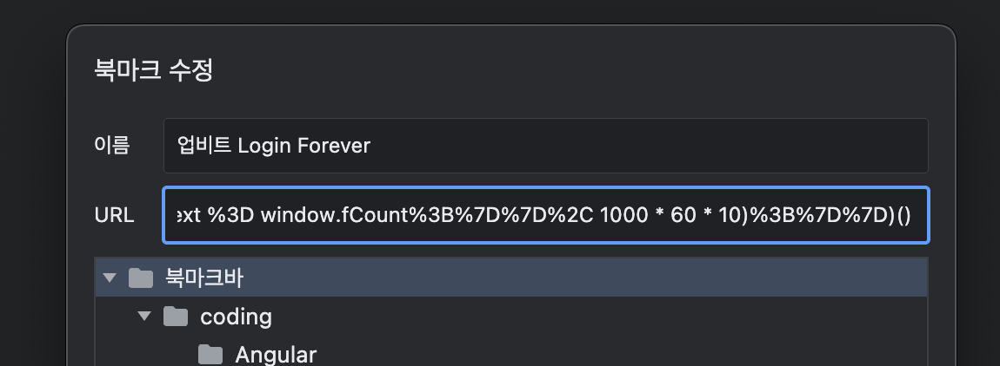

import {faGithub} from "@fortawesome/free-brands-svg-icons";

<div className="lead">
데스크탑에서 업비트 차트를 띄워 놓고 보는 기간이 있는데요. 로그인이 불편한데다가 수동으로 연장할 수 있는 기간도 30분으로 짧아서 틈만나면 로그아웃되어 있기를 어언 몇개월... 🤯
</div>

삶의 질을 높이고자 나 대신 로그인 연장버튼을 눌러주는 간단한 자바스크립트 코드를 만들어서 공유해요.
북마클릿으로 사용하고 있는데 매우 만족스럽답니다. 🏝️
이 프로젝트는 <FontAwesomeIcon icon={faGithub} /> [upbit-web-login-forever](https://github.com/designmeme/upbit-web-login-forever)에서 확인할 수 있어요.

---
## 북마클릿 사용하기

1. 아래 북마클릿을 브라우저의 즐겨찾기(북마크)로 등록합니다.
    ```
    javascript:(function()%7Bif%20(window.location.hostname%20%3D%3D%3D%20'upbit.com'%20%26%26%20!window.fInterval)%20%7Bwindow.fCount%20%3D%200%3Bconst%20div%20%3D%20document.createElement('div')%3Bdiv.style.zIndex%20%3D%20'1000'%3Bdiv.style.position%20%3D%20'fixed'%3Bdiv.style.top%20%3D%20'0'%3Bdiv.style.right%20%3D%20'calc(50%25%20-%20446px)'%3Bdiv.style.padding%20%3D%20'0%20.4em'%3Bdiv.style.background%20%3D%20'yellow'%3Bdiv.style.color%20%3D%20'black'%3Bdiv.style.cursor%20%3D%20'help'%3Bdiv.title%20%3D%20'%EB%A1%9C%EA%B7%B8%EC%9D%B8%20%22%EC%97%B0%EC%9E%A5%22%20%EB%B2%84%ED%8A%BC%EC%9D%B4%20%EB%82%98%ED%83%80%EB%82%98%EB%A9%B4%20%EC%9E%90%EB%8F%99%EC%9C%BC%EB%A1%9C%20%ED%81%B4%EB%A6%AD%ED%95%A0%20%EA%B1%B0%EC%97%90%EC%9A%94.%20%EA%B7%B8%EB%A7%8C%20%EC%82%AC%EC%9A%A9%ED%95%98%EB%A0%A4%EB%A9%B4%20%ED%8E%98%EC%9D%B4%EC%A7%80%EB%A5%BC%20%EC%83%88%EB%A1%9C%EA%B3%A0%EC%B9%A8%20%ED%95%98%EC%84%B8%EC%9A%94'%3Bdiv.innerHTML%20%3D%20%60%F0%9F%91%BB%20%EC%9E%90%EB%8F%99%EC%97%B0%EC%9E%A5%20%EC%82%AC%EC%9A%A9%EC%A4%91(%3Cspan%20id%3D%22extend-count%22%3E%24%7Bwindow.fCount%7D%3C%2Fspan%3E)%60%3Bdocument.body.prepend(div)%3Bwindow.fInterval%20%3D%20setInterval(()%20%3D%3E%20%7Bconst%20target%20%3D%20document.evaluate('%2F%2Fa%5Btext()%3D%22%EC%97%B0%EC%9E%A5%22%20or%20text()%3D%22Extend%22%5D'%2C%20document).iterateNext()%3Bif%20(target)%20%7Btarget.click()%3Bwindow.fCount%2B%2B%3Bdocument.getElementById('extend-count').innerText%20%3D%20window.fCount%3B%7D%7D%2C%201000%20*%2060%20*%2010)%3B%7D%7D)()
    ```

    

2. 업비트 웹사이트에 로그인 후 1)에서 등록한 즐겨찾기를 클릭합니다.

    

3. 화면 상단에 `자동연장 사용중(0)` 영역이 보입니다. 마우스를 올리면 툴팁으로 안내사항이 보여요.

    

4. 로그인 '연장' 버튼이 생기면 자동으로 클릭되어 로그인이 연장되고 화면에 연장 횟수가 `자동연장 사용중(1)` 처럼 변경됩니다. 웹사이트의 언어 설정(한국어, 영어)에 관계없이 모두 작동해요.

    

---
## 그만 사용하기

1. 사용 중인 탭/창에서 화면을 새로고침해요.
2. 사용 중인 탭/창을 닫아요.

---
## 코드 설명

북마클릿의 원본 [소스코드(main.js)](https://github.com/designmeme/upbit-web-login-forever/blob/main/main.js)는 매우 간단해요.

<p className="code-label">main.js</p>

```js{numberLines: true}
if (window.location.hostname === 'upbit.com' && !window.fInterval) {
	window.fCount = 0;

	const div = document.createElement('div');
	div.style.zIndex = '1000';
	div.style.position = 'fixed';
	div.style.top = '0';
	div.style.right = 'calc(50% - 446px)';
	div.style.padding = '0 .4em';
	div.style.background = 'yellow';
	div.style.color = 'black';
	div.style.cursor = 'help';
	div.title = '로그인 "연장" 버튼이 나타나면 자동으로 클릭할 거에요. 그만 사용하려면 페이지를 새로고침 하세요';
	div.innerHTML = `👻 자동연장 사용중(<span id="extend-count">${window.fCount}</span>)`;
	document.body.prepend(div);

	window.fInterval = setInterval(() => {
		const target = document.evaluate('//a[text()="연장" or text()="Extend"]', document).iterateNext();
		if (target) {
			target.click();
			window.fCount++;
			document.getElementById('extend-count').innerText = window.fCount;
		}
	}, 1000 * 60 * 10);
}
```

* **1**번 줄: 북마크를 클릭 했을 때 활성화된 웹사이트의 주소가 `upbit.com`인 경우만 동작해요.
* **4~15**번 줄: 자동연장 기능을 사용 하고 있다는 것을 알 수 있게 **사용중 안내 요소**를 만들어서 사이트 헤더에 추가해요.
* **17~24**번 줄: 10분 마다 로그인 **연장(Extend)** 버튼이 있는지 확인하고 있다면 클릭해서 로그인을 연장해요. 참고로 로그인 연장 버튼은 잔여시간이 30분 남은 시점부터 표시되고 있어요.
* **21~22**번 줄: 자동으로 로그인을 연장했다면 **연장 횟수**가 그에 맞춰 변경돼요.

참고로 원본 코드를 [북마클릿 생성기](https://mrcoles.com/bookmarklet/)를 사용해 북마클릿 코드로 변환했어요.
